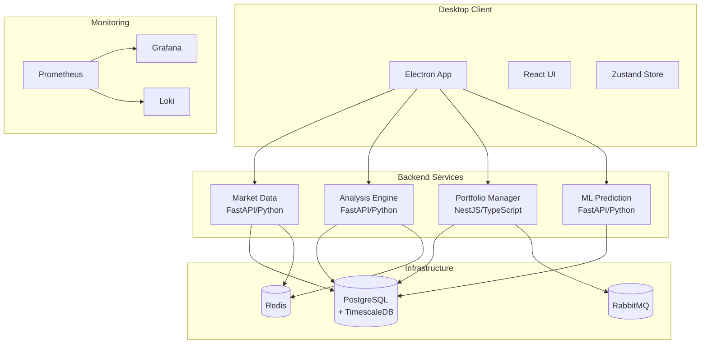

# TRII Investment Decision Support Platform

> **🚀 Professional Desktop Application for Real-Time Market Analysis and Investment Decision Making**

[](https://github.com/your-org/investment-app/actions)
[](https://kubernetes.io/)
[](https://pytorch.org/)
[](LICENSE)

TRII is a professional-grade desktop application designed for **real-time market analysis and investment decision making**. Built with modern microservices architecture, it provides investors with comprehensive tools for portfolio management, technical analysis, and AI-powered insights.

## ✨ Key Features

### 🤖 AI-Powered Analysis
- **Machine Learning Predictions**: ML models trained on historical market data
- **Technical Indicators**: RSI, MACD, Bollinger Bands, and advanced indicators
- **Portfolio Optimization**: Automated rebalancing algorithms
- **Anomaly Detection**: Early identification of opportunities and risks

### 📊 Real-Time Market Data
- **Live Quotes**: Real-time market data and price feeds
- **Historical Data**: Time-series data with TimescaleDB optimization
- **Portfolio Tracking**: Comprehensive position and performance monitoring
- **Watchlist Management**: Custom symbol tracking and alerts

### 🛡️ Enterprise Security
- **Local Data Storage**: All data stays on user's machine
- **Encrypted Storage**: Secure local database and configuration
- **Audit Logging**: Complete transaction and activity logs
- **Privacy-First**: No cloud dependency for core functionality

### 💻 Professional Desktop Experience
- **Cross-Platform**: Windows, macOS, and Linux support
- **Modern UI**: React-based interface with dark mode
- **Real-Time Updates**: Live data synchronization
- **Offline Capable**: Core functionality works without internet

## 🚀 Quick Start

### For End Users (Future Release)

**v1.0.0 Release** (Planned: Q1 2025):

```bash
# Download installer for your platform
# Windows: TRII-Platform-Setup-1.0.0.exe
# macOS: TRII-Platform-1.0.0.dmg
# Linux: TRII-Platform-1.0.0.AppImage

# Run installer and follow setup wizard
# Application auto-starts backend services
```

### For Developers

**Prerequisites**:
- Node.js >= 18
- Python >= 3.11
- pnpm >= 8
- Docker Desktop

**Quick Setup**:

```bash
# Clone repository
git clone https://github.com/your-org/investment-app.git
cd investment-app

# Install dependencies
pnpm install

# Start backend services
docker-compose up -d

# Start desktop client
pnpm dev
```

## 🏗️ System Architecture



## 🛠️ Technology Stack

### Desktop Application
- **Electron 28**: Cross-platform desktop framework
- **React 18 + TypeScript**: Modern UI development
- **Zustand**: Lightweight state management
- **TailwindCSS**: Utility-first styling
- **Recharts**: Data visualization

### Backend Microservices
- **Market Data Service**: FastAPI/Python - Real-time market data
- **Analysis Engine**: FastAPI/Python - Technical analysis & indicators
- **Portfolio Manager**: NestJS/TypeScript - Portfolio tracking
- **ML Prediction Service**: FastAPI/Python - AI/ML predictions

### Data & Infrastructure
- **PostgreSQL + TimescaleDB**: Time-series database
- **Redis**: Caching and session storage
- **RabbitMQ**: Message queuing
- **Docker Compose**: Local development
- **Kubernetes + ArgoCD**: Production deployment

### DevOps & Monitoring
- **GitHub Actions**: CI/CD automation
- **Prometheus + Grafana**: Monitoring and alerting
- **Loki**: Log aggregation
- **Helm Charts**: Kubernetes packaging

## 📁 Project Structure

```
investment-app/
├── apps/
│   ├── desktop-client/          # Electron + React application
│   │   ├── src/
│   │   │   ├── main/            # Electron main process
│   │   │   │   └── managers/    # Backend & Update managers
│   │   │   └── renderer/        # React UI
│   │   │       ├── components/
│   │   │       │   └── common/  # Shared UI components
│   │   │       └── store/       # Zustand state management
│   │   └── resources/           # Icons, build assets
│   └── next-frontend/           # Next.js web application
├── services/                    # Backend microservices
│   ├── market-data/            # FastAPI - Real-time quotes
│   ├── analysis-engine/        # FastAPI - Technical analysis
│   ├── portfolio-manager/      # NestJS - Portfolio tracking
│   └── ml-prediction/          # FastAPI - ML predictions
├── infrastructure/
│   ├── docker/                 # Docker Compose configs
│   ├── kubernetes/             # K8s manifests + ArgoCD
│   │   ├── base/               # Base configurations
│   │   ├── overlays/           # Environment overlays
│   │   └── argocd/             # GitOps applications
│   └── monitoring/             # Prometheus, Grafana, Loki
├── database/                   # Database schemas & migrations
├── scripts/                    # Automation scripts
├── docs/                       # Documentation
└── .github/workflows/          # CI/CD pipelines
```

## 📊 Platform Access (Development)

When running locally, access these services:

| Service | URL | Credentials | Description |
|---------|-----|-------------|-------------|
| **🖥️ TRII Desktop** | Local App | - | Main desktop application |
| **🔧 ArgoCD** | https://argocd.local | admin/admin123 | GitOps dashboard |
| **📊 Grafana** | http://localhost:3000 | admin/admin | Monitoring dashboards |
| **📈 Prometheus** | http://localhost:9090 | - | Metrics collection |
| **🐰 RabbitMQ** | http://localhost:15672 | guest/guest | Message queue |

## 🚀 Deployment Options

### Local Development
```bash
# Start all services
docker-compose up -d

# Start desktop client
pnpm dev
```

### Production Deployment
```bash
# Deploy to Kubernetes with ArgoCD
kubectl apply -f infrastructure/kubernetes/
```

### Binary Distribution (Planned)
- **Windows**: `.exe` installer with auto-updates
- **macOS**: `.dmg` with code signing
- **Linux**: `.AppImage` with desktop integration

## 📊 Monitoring & Observability

### Available Dashboards
- **Platform Overview**: System health and performance
- **Business Intelligence**: User metrics and engagement
- **ML Performance**: AI model accuracy and predictions
- **Infrastructure**: Kubernetes resource utilization

### Key Metrics
- **Uptime**: 99.9% target SLA
- **Response Time**: <100ms p95 for API calls
- **Data Freshness**: <5s market data latency
- **ML Accuracy**: >85% prediction accuracy

## 🔧 Development

### Local Setup
```bash
# Install dependencies
pnpm install

# Start infrastructure
docker-compose up -d

# Run database migrations
docker exec trii-postgres psql -U postgres -d trii -f /docker-entrypoint-initdb.d/init_db.sql

# Start development
pnpm dev

# Run tests
pnpm test
```

### Code Quality
- **TypeScript**: Strict mode enabled
- **ESLint + Prettier**: Code formatting and linting
- **Python**: Black + isort + mypy
- **Testing**: Jest for frontend, pytest for backend

## 📚 Documentation

- [🏗️ System Architecture](docs/architecture/README.md)
- [🗄️ Database Schema](docs/database/schema.md)
- [🔌 API Documentation](docs/api/README.md)
- [📊 Monitoring Guide](docs/operations/monitoring.md)
- [🛡️ Security & Compliance](docs/security/README.md)
- [🚀 Deployment Guide](docs/deployment/README.md)
- [🧪 Testing Strategy](docs/testing/README.md)

## 🤝 Contributing

1. **Fork** the repository
2. **Create** feature branch (`git checkout -b feature/amazing-feature`)
3. **Develop** with tests and documentation
4. **Commit** using conventional commits
5. **Push** and create pull request

### Development Standards
- **Conventional Commits**: `feat:`, `fix:`, `docs:`, etc.
- **Testing**: Minimum 80% code coverage
- **Documentation**: Update docs for API changes
- **Security**: Follow security best practices

## 📄 License

**Private/Commercial License** - All rights reserved.

## 📞 Support & Community

- **Issues**: [GitHub Issues](https://github.com/your-org/investment-app/issues)
- **Discussions**: [GitHub Discussions](https://github.com/your-org/investment-app/discussions)
- **Email**: support@trii-platform.com

## 🏆 Project Status

**Current Status**: Beta Release Ready
**Target Release**: Q1 2025
**Health Score**: 8/10 ✅

---

**Version**: 1.0.0-beta | **Last Updated**: January 2025

**Built with ❤️ for intelligent investment decisions**
