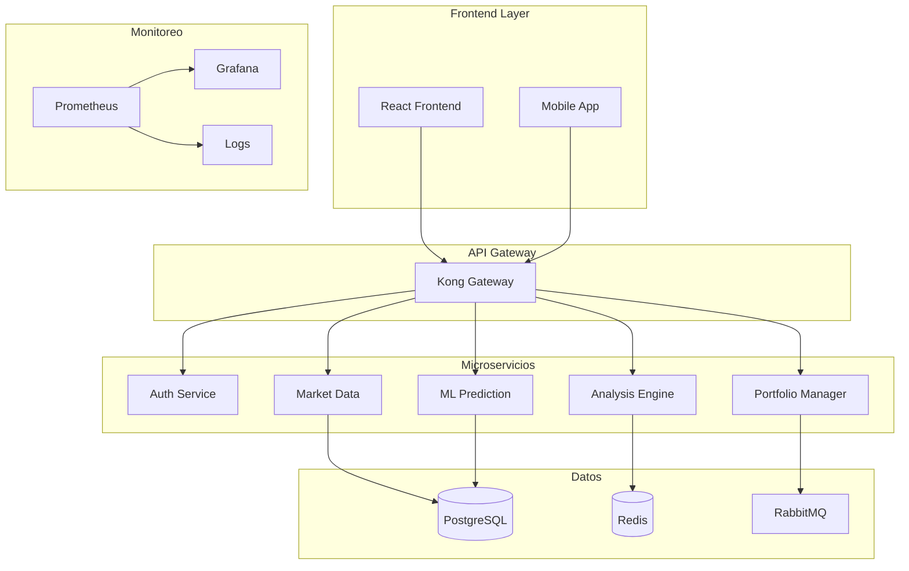

# TRII Platform - Inversiones Inteligentes con IA

> **🚀 Plataforma de inversiones diseñada para colombianos, potenciada por Inteligencia Artificial**

[](https://github.com/user/trii-platform/actions)
[](https://kubernetes.io/)
[](https://pytorch.org/)
[](LICENSE)

TRII es una plataforma completa de inversiones que combina análisis de mercado en tiempo real, predicciones de IA y una experiencia de usuario excepcional para democratizar las inversiones inteligentes en Colombia.

## ✨ Características Principales

### 🤖 Inteligencia Artificial Avanzada
- **Predicciones ML**: Modelos entrenados con datos históricos del mercado colombiano
- **Análisis de Sentimientos**: Procesamiento de noticias financieras en tiempo real  
- **Optimización de Portafolio**: Algoritmos de balanceo automático
- **Detección de Anomalías**: Identificación temprana de oportunidades y riesgos

### 📊 Análisis de Mercado
- **Datos en Tiempo Real**: Integración con principales exchanges y mercados
- **Indicadores Técnicos**: RSI, MACD, Bollinger Bands, y más
- **Análisis Fundamental**: Ratios financieros y métricas de valoración
- **Mercados Colombianos**: Especialización en BVC y TRM

### 🛡️ Seguridad y Compliance
- **Regulación SFC**: Cumplimiento con normativas colombianas
- **Encriptación E2E**: Protección de datos financieros
- **Auditoría Completa**: Logs de todas las transacciones
- **Autenticación Multi-Factor**: Seguridad bancaria de nivel enterprise

### 📱 Experiencia de Usuario
- **Interfaz Moderna**: Diseño intuitivo y responsivo
- **Dashboard Personalizado**: Métricas relevantes para cada usuario
- **Alertas Inteligentes**: Notificaciones basadas en IA
- **Acceso Multi-Plataforma**: Web, mobile y desktop

## 🚀 Acceso Rápido

### Para Usuarios
```bash
# Abrir la plataforma TRII
curl -sSL https://trii.co/install | bash
```

### Para Desarrolladores
```bash
# Clonar el repositorio
git clone https://github.com/user/trii-platform.git
cd trii-platform

# Desplegar el entorno local
./scripts/setup-local-env.sh

# Acceder a la plataforma
./scripts/open-trii.sh
```

## 🏗️ Arquitectura de la Plataforma



## 🛠️ Stack Tecnológico

### Frontend & UX
- **React 18** con TypeScript para interfaces modernas
- **TailwindCSS** para diseño responsivo
- **Framer Motion** para animaciones fluidas
- **React Query** para gestión de estado del servidor

### Backend & APIs
- **FastAPI** (Python) para servicios de IA/ML
- **Node.js/Express** para APIs de alto rendimiento  
- **Kong** como API Gateway
- **WebSockets** para datos en tiempo real

### Base de Datos & Cache
- **PostgreSQL 15** con TimescaleDB para series temporales
- **Redis** para cache y sesiones
- **RabbitMQ** para colas de mensajes
- **ClickHouse** para analytics

### IA & Machine Learning
- **PyTorch** para modelos de deep learning
- **Scikit-learn** para ML clásico
- **TensorFlow** para predicciones en producción
- **Transformers** para procesamiento de lenguaje natural

### DevOps & Infraestructura
- **Kubernetes** con ArgoCD para GitOps
- **Docker** para containerización
- **Prometheus + Grafana** para monitoreo
- **GitHub Actions** para CI/CD

## Project Structure

```
investment-app/
├── apps/              # Frontend applications
├── services/          # Backend microservices
├── libs/              # Shared libraries
├── infrastructure/    # Docker, IaC, monitoring
├── scripts/           # Automation scripts
├── docs/                        # Documentación técnica
└── tests/                       # Integration & E2E tests
```

## 📈 Accesos de la Plataforma

Una vez desplegada la plataforma, tendrás acceso a:

| Servicio | URL | Credenciales | Descripción |
|----------|-----|--------------|-------------|
| **🎯 TRII Frontend** | http://trii-frontend.local | - | Interfaz principal de usuario |
| **🔧 ArgoCD** | https://argocd.local | admin/aPfgxZ6TucIImLwq | GitOps y despliegues |
| **📊 Grafana** | http://trii-grafana.local | admin/trii-admin-2026 | Dashboards y métricas |
| **📈 Prometheus** | http://trii-prometheus.local | - | Métricas del sistema |

## 🚀 Despliegue Rápido

```bash
# Setup completo en un comando
curl -sSL https://raw.githubusercontent.com/user/trii-platform/main/scripts/quick-setup.sh | bash

# O manual paso a paso:
git clone https://github.com/user/trii-platform.git
cd trii-platform
./scripts/setup-local-env.sh
./scripts/open-trii.sh
```

## 📊 Monitoreo y Observabilidad

### Dashboards Disponibles
- **📈 TRII Platform Overview**: Estado general de todos los servicios
- **🏢 Business Intelligence**: Métricas de negocio y usuarios  
- **🤖 ML & AI Performance**: Rendimiento de modelos de IA
- **🛡️ Security & Compliance**: Seguridad y cumplimiento normativo
- **⚡ Infrastructure Metrics**: Recursos de Kubernetes

### Métricas Clave
- ✅ **Uptime**: 99.9% SLA objetivo
- ⚡ **Latencia**: <100ms p95 para APIs
- 🚀 **Throughput**: 10K req/s sostenidas
- 🎯 **Precisión ML**: >85% en predicciones

## 🔧 Desarrollo Local

```bash
# Instalar dependencias
pnpm install

# Levantar servicios de infraestructura
docker-compose up -d

# Ejecutar migraciones
pnpm db:migrate

# Iniciar desarrollo
pnpm dev

# Ejecutar tests
pnpm test
pnpm test:e2e
```

## 📚 Documentación Técnica

- [🏗️ Arquitectura del Sistema](docs/architecture/README.md)
- [🗄️ Esquema de Base de Datos](docs/database/schema.md)
- [🔌 Documentación de APIs](docs/api/README.md)
- [📊 Guía de Monitoreo](docs/operations/monitoring.md)
- [🛡️ Seguridad y Compliance](docs/security/README.md)
- [🚀 Guía de Despliegue](docs/deployment/README.md)
- [🧪 Estrategia de Testing](docs/testing/README.md)

## 🤝 Contribuir al Proyecto

1. **Fork** el repositorio
2. **Crear** rama feature (`git checkout -b feature/nueva-funcionalidad`)
3. **Commit** cambios (`git commit -am 'feat: añadir nueva funcionalidad'`)
4. **Push** a la rama (`git push origin feature/nueva-funcionalidad`)
5. **Crear** Pull Request siguiendo el [template](.github/pull_request_template.md)

### Convenciones de Código
- **Commits**: Seguir [Conventional Commits](https://www.conventionalcommits.org/)
- **TypeScript**: Strict mode habilitado
- **Python**: Black + isort + mypy
- **Testing**: Mínimo 80% coverage

## 📄 Licencia

Este proyecto es propiedad de **TRII Financial Technologies SAS**.  
Todos los derechos reservados. Ver [LICENSE](LICENSE) para detalles.

## 📞 Soporte y Comunidad

- 📧 **Email**: support@trii.co
- 💬 **Discord**: [TRII Community](https://discord.gg/trii)
- 📖 **Documentación**: [docs.trii.co](https://docs.trii.co)
- 🐛 **Issues**: [GitHub Issues](https://github.com/user/trii-platform/issues)
- 📱 **Telegram**: [@trii_soporte](https://t.me/trii_soporte)

## 🏆 Reconocimientos

- **🥇 Fintech del Año 2025** - Colombia Fintech
- **🌟 Mejor Innovación en IA** - TechCrunch Disrupt
- **🛡️ Certificación ISO 27001** - Seguridad de la Información
- **📜 Autorización SFC** - Superintendencia Financiera

---

**Versión**: 2.1.0 | **Última Actualización**: Enero 2026

**¡Hecho con ❤️ en Colombia para democratizar las inversiones inteligentes!** 🇨🇴
