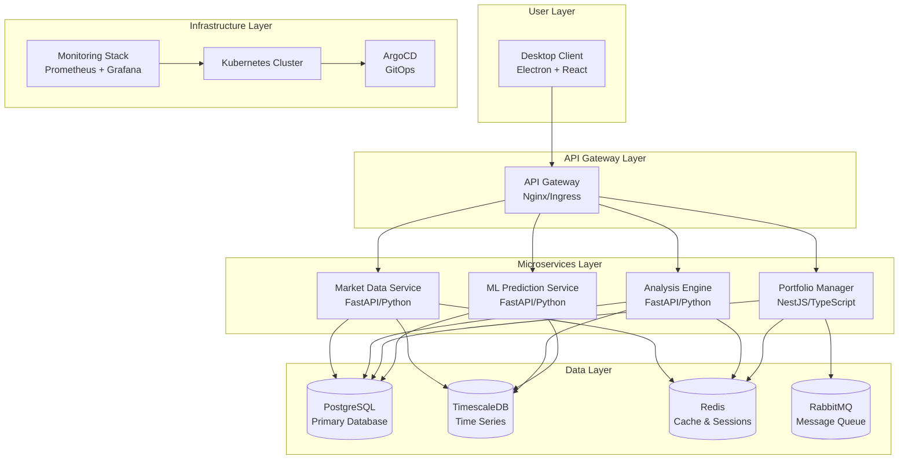

# TRII Platform - System Architecture

## Overview

The TRII Investment Decision Support Platform is built as a modern microservices architecture designed for desktop deployment with enterprise-grade reliability and performance. The system combines real-time market data processing, AI-powered analysis, and a professional desktop user experience.

## High-Level Architecture

## Component Details

### Desktop Client

**Technology**: Electron 28 + React 18 + TypeScript
**Purpose**: Cross-platform desktop application providing the user interface

**Key Components**:
- **Main Process**: Electron main process handling system integration
- **Renderer Process**: React application with modern UI
- **State Management**: Zustand for client-side state
- **Backend Manager**: Handles communication with microservices

**Responsibilities**:
- User interface and experience
- Local data storage and caching
- Service lifecycle management
- Real-time data synchronization

### Microservices

#### Market Data Service
- **Framework**: FastAPI (Python)
- **Purpose**: Real-time market data aggregation and serving
- **Key Features**:
  - Live price feeds
  - Historical data retrieval
  - Market data normalization
  - Rate limiting and caching

#### Analysis Engine
- **Framework**: FastAPI (Python)
- **Purpose**: Technical analysis and financial calculations
- **Key Features**:
  - Technical indicators (RSI, MACD, Bollinger Bands)
  - Chart pattern recognition
  - Statistical analysis
  - Real-time calculations

#### Portfolio Manager
- **Framework**: NestJS (TypeScript)
- **Purpose**: Portfolio tracking and management
- **Key Features**:
  - Position tracking
  - Transaction management
  - Performance calculations
  - Risk assessment

#### ML Prediction Service
- **Framework**: FastAPI (Python)
- **Purpose**: AI/ML-powered investment insights
- **Key Features**:
  - Price prediction models
  - Anomaly detection
  - Sentiment analysis
  - Recommendation engine

### Data Architecture

#### PostgreSQL (Primary Database)
**Purpose**: Main application data storage
**Key Tables**:
- `users` - User accounts and profiles
- `portfolios` - Investment portfolios
- `positions` - Current holdings
- `transactions` - Buy/sell operations
- `watchlist` - User watchlists
- `alerts` - Price and signal alerts
- `recommendations` - AI-generated recommendations

#### TimescaleDB (Time Series)
**Purpose**: High-performance time series data
**Key Tables**:
- `quotes` - Real-time price quotes
- `historical_prices` - OHLCV historical data
- `audit_log` - System audit trail

#### Redis (Cache & Sessions)
**Purpose**: High-speed caching and session management
**Usage**:
- Market data caching
- Session storage
- Real-time data buffering
- Rate limiting

#### RabbitMQ (Message Queue)
**Purpose**: Asynchronous message processing
**Usage**:
- Inter-service communication
- Background job processing
- Event-driven architecture

### Infrastructure Components

#### Kubernetes
**Deployment Strategy**: Microservices deployed as separate pods
**Key Features**:
- Auto-scaling based on load
- Rolling updates with zero downtime
- Resource limits and quotas
- Health checks and self-healing

#### ArgoCD
**GitOps Implementation**:
- Declarative deployment manifests
- Automated synchronization
- Rollback capabilities
- Multi-environment support

#### Monitoring Stack
**Components**:
- **Prometheus**: Metrics collection and alerting
- **Grafana**: Visualization and dashboards
- **Loki**: Log aggregation and querying
- **AlertManager**: Alert routing and management

## Communication Patterns

### Synchronous Communication
- REST APIs between desktop client and microservices
- Direct database queries for complex aggregations
- Real-time WebSocket connections for live data

### Asynchronous Communication
- RabbitMQ for inter-service messaging
- Event-driven updates for portfolio changes
- Background processing for ML model training

## Security Architecture

### Authentication & Authorization
- JWT-based authentication
- Role-based access control (RBAC)
- API key management for external services

### Data Protection
- End-to-end encryption for sensitive data
- Database-level encryption
- Secure communication via TLS/HTTPS

### Network Security
- Service mesh with mutual TLS
- Network policies in Kubernetes
- API rate limiting and throttling

## Deployment Architecture

### Development Environment
- Docker Compose for local development
- Hot reloading for frontend development
- Shared volumes for data persistence

### Production Environment
- Kubernetes cluster deployment
- ArgoCD for continuous deployment
- Multi-zone availability
- Automated scaling and failover

### Binary Distribution
- Electron Builder for cross-platform binaries
- Auto-update mechanism
- Code signing for security
- Installer packages for each platform

## Performance Characteristics

### Scalability
- Horizontal scaling of microservices
- Database read replicas
- CDN for static assets
- Caching layers for performance

### Reliability
- Circuit breakers for fault tolerance
- Retry mechanisms with exponential backoff
- Graceful degradation under load
- Comprehensive error handling

### Monitoring
- Application Performance Monitoring (APM)
- Distributed tracing
- Log aggregation and correlation
- Real-time alerting

## Data Flow Examples

### Real-Time Quote Update
1. Market data provider → Market Data Service
2. Service processes and stores in TimescaleDB
3. Redis cache updated for fast access
4. WebSocket push to connected desktop clients
5. Client updates UI in real-time

### Portfolio Analysis
1. User requests analysis → Desktop Client
2. Request routed to Analysis Engine via API Gateway
3. Engine queries historical data from TimescaleDB
4. Technical indicators calculated
5. ML predictions fetched from ML Prediction Service
6. Results aggregated and returned to client

### Transaction Processing
1. User submits trade → Desktop Client
2. Request sent to Portfolio Manager
3. Transaction validated and stored in PostgreSQL
4. Position updated in real-time
5. Event published to RabbitMQ for downstream processing
6. Analysis Engine notified for portfolio rebalancing

This architecture provides a robust, scalable, and maintainable foundation for the TRII investment platform, designed to handle the complex requirements of real-time financial data processing and AI-powered investment analysis.