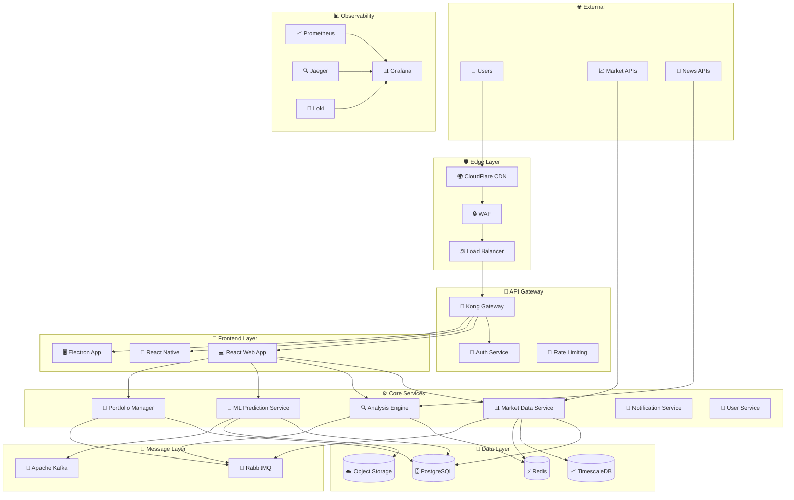
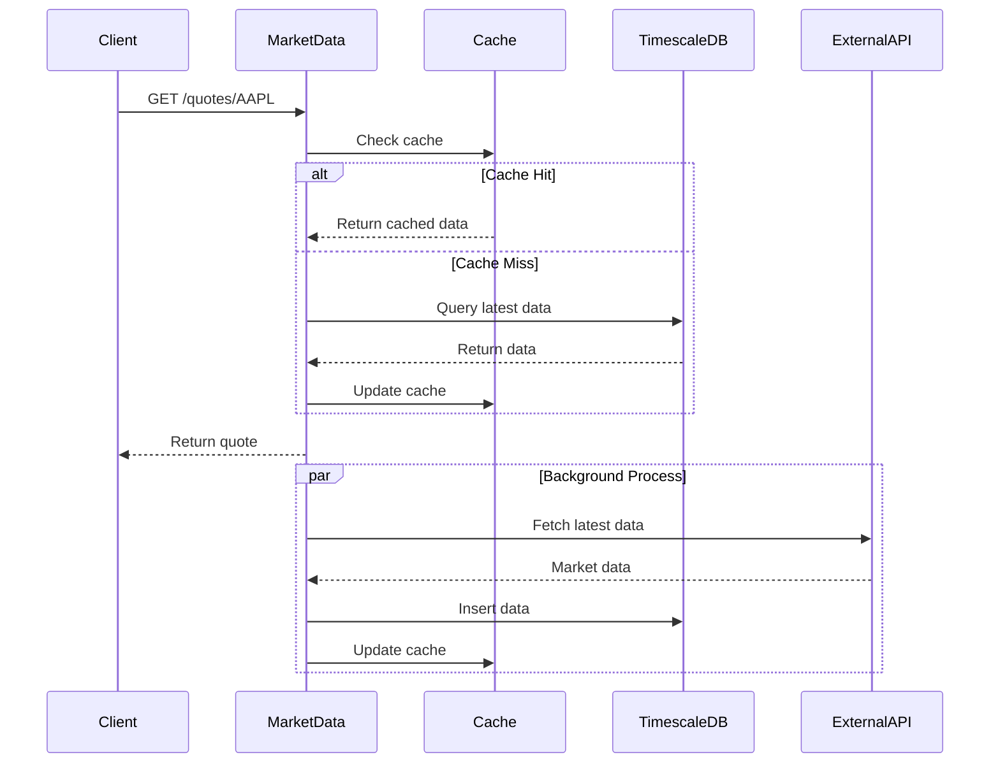
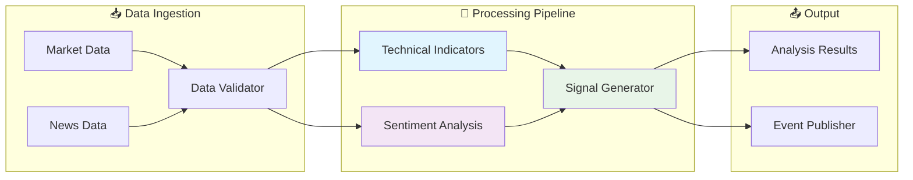
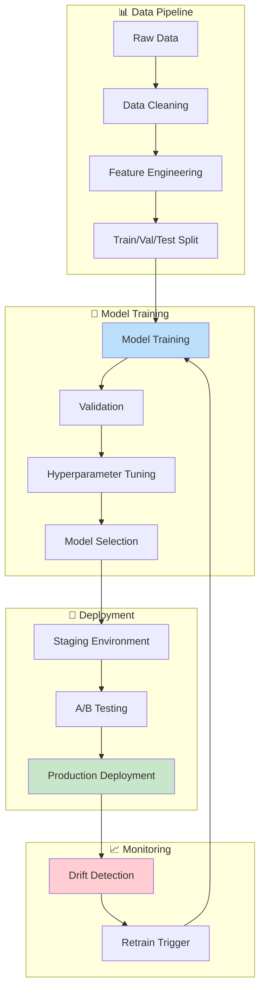
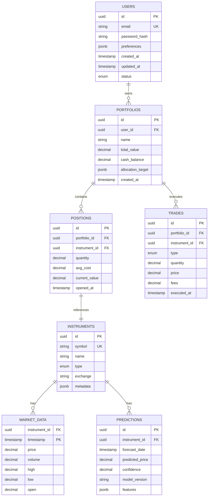
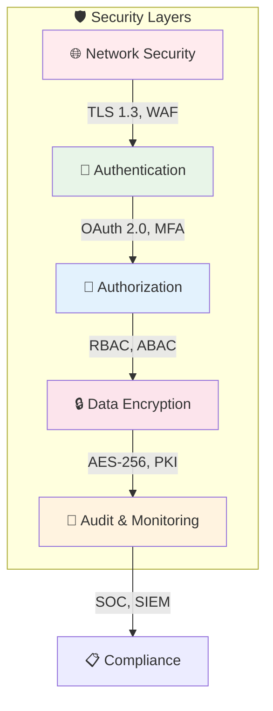

# Arquitectura del Sistema TRII Platform

## 🏗️ Visión General

TRII Platform está diseñada siguiendo principios de **arquitectura de microservicios**, **domain-driven design** y **event-driven architecture** para garantizar escalabilidad, mantenibilidad y alta disponibilidad.

## 🎯 Principios Arquitectónicos

### 1. **Separation of Concerns**
- Cada microservicio tiene una responsabilidad específica
- Boundaries claros entre dominios de negocio
- APIs bien definidas entre servicios

### 2. **Event-Driven Architecture**
- Comunicación asíncrona via RabbitMQ
- Event sourcing para auditabilidad
- CQRS para separar lecturas y escrituras

### 3. **Cloud-Native**
- Containerización con Docker
- Orquestación con Kubernetes  
- Observabilidad integrada
- Auto-scaling horizontal

## 🏛️ Diagrama de Arquitectura de Alto Nivel



## 🔧 Arquitectura de Microservicios

### 📊 Market Data Service
**Responsabilidades:**
- Ingesta de datos de mercado en tiempo real
- Normalización de datos de múltiples fuentes
- Cache distribuido de cotizaciones
- WebSocket streams para clientes

**Tecnologías:**
- FastAPI + AsyncIO para alta concurrencia
- TimescaleDB para series temporales
- Redis para cache L1
- WebSockets para streaming



### 🔍 Analysis Engine
**Responsabilidades:**
- Análisis técnico avanzado (RSI, MACD, Bollinger Bands)
- Procesamiento de sentiment de noticias
- Cálculo de indicadores personalizados
- Backtesting de estrategias

**Patrón de Arquitectura:** **Pipeline Pattern**



### 🤖 ML Prediction Service
**Responsabilidades:**
- Entrenamiento de modelos predictivos
- Inferencia en tiempo real
- A/B testing de modelos
- Feature engineering

**Arquitectura ML:**



### 💼 Portfolio Manager
**Responsabilidades:**
- Optimización de portafolios
- Gestión de riesgo
- Rebalanceo automático
- Reporting de performance

**Patrón:** **Strategy Pattern** para algoritmos de optimización

## 🗄️ Arquitectura de Datos

### Modelo de Datos Principal



### 📊 Particionamiento de TimescaleDB

```sql
-- Particionamiento por tiempo para market_data
CREATE TABLE market_data (
    instrument_id UUID NOT NULL,
    timestamp TIMESTAMPTZ NOT NULL,
    price DECIMAL(20,8) NOT NULL,
    volume DECIMAL(20,8),
    high DECIMAL(20,8),
    low DECIMAL(20,8),
    open DECIMAL(20,8)
);

-- Convertir a hypertable con particionamiento por tiempo
SELECT create_hypertable('market_data', 'timestamp', chunk_time_interval => INTERVAL '1 day');

-- Crear índices optimizados
CREATE INDEX idx_market_data_instrument_time ON market_data (instrument_id, timestamp DESC);
CREATE INDEX idx_market_data_timestamp ON market_data (timestamp DESC);
```

## 🚦 Patrones de Comunicación

### 1. **Synchronous Communication** (REST APIs)
```yaml
Pattern: Request-Response
Use Case: Client-facing APIs, real-time queries
Technology: HTTP/REST with OpenAPI specs
Timeout: 30 seconds max
```

### 2. **Asynchronous Communication** (Events)
```yaml
Pattern: Publish-Subscribe
Use Case: Inter-service communication, data updates
Technology: RabbitMQ with topic exchanges
Delivery: At-least-once with idempotency
```

### 3. **Streaming Communication** (Real-time)
```yaml
Pattern: WebSocket/Server-Sent Events
Use Case: Live market data, notifications
Technology: WebSockets with Redis pub/sub
Scaling: Horizontal with sticky sessions
```

## 🔐 Seguridad por Capas



## 📈 Estrategia de Escalabilidad

### Horizontal Scaling
- **Stateless services**: Todos los microservicios son stateless
- **Load balancing**: NGINX + Kong Gateway
- **Auto-scaling**: HPA basado en CPU/memoria/custom metrics
- **Database sharding**: Particionamiento por user_id

### Vertical Scaling
- **Resource optimization**: Profiling continuo de servicios
- **Caching layers**: L1 (Redis), L2 (CDN), L3 (Application)
- **Connection pooling**: PgBouncer para PostgreSQL
- **Query optimization**: Índices optimizados, query analysis

## 🔄 DevOps y CI/CD


### Pipeline Stages
1. **🔍 Code Quality**: ESLint, Prettier, SonarQube
2. **🧪 Testing**: Unit, Integration, E2E tests
3. **🔒 Security**: SAST, DAST, dependency scanning
4. **📦 Build**: Docker images, Helm charts
5. **🚀 Deploy**: Staging → Production via ArgoCD
6. **📊 Monitor**: Synthetic tests, alerts

## 🎯 SLAs y Métricas

### Service Level Objectives (SLOs)
- **Availability**: 99.9% uptime (8.77 hours downtime/year)
- **Latency**: p95 < 200ms para APIs críticas
- **Throughput**: 10,000 requests/second sostenidas
- **Data Freshness**: Market data < 100ms delay

### Key Performance Indicators (KPIs)
- **MTTR** (Mean Time To Recovery): < 15 minutes
- **MTTD** (Mean Time To Detection): < 2 minutes
- **Error Rate**: < 0.1% para operaciones críticas
- **Customer Satisfaction**: NPS > 70

---

**Última actualización**: Enero 2026  
**Versión**: 2.1.0