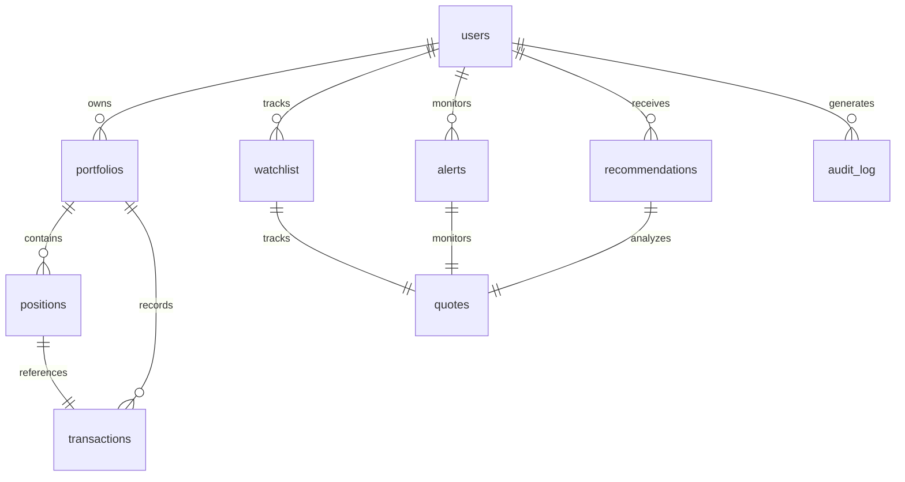

# TRII Platform - Database Schema

## Overview

The TRII platform uses PostgreSQL as the primary database with TimescaleDB extension for time-series data optimization. The schema is designed to support real-time market data, portfolio management, and AI-powered analysis.

## Database Architecture

### Primary Database: PostgreSQL
- **Version**: PostgreSQL 15+
- **Extensions**: TimescaleDB, pg_stat_statements
- **Character Set**: UTF-8
- **Collation**: en_US.UTF-8

### Time-Series Database: TimescaleDB
- **Purpose**: Optimized storage and querying of time-series data
- **Hypertables**: `historical_prices`, `audit_log`
- **Chunk Size**: 1 day for historical data, 1 week for audit logs

## Core Tables

### Users Table
```sql
CREATE TABLE users (
    id BIGSERIAL PRIMARY KEY,
    email VARCHAR(255) UNIQUE NOT NULL,
    username VARCHAR(50) UNIQUE NOT NULL,
    hashed_password VARCHAR(255) NOT NULL,
    full_name VARCHAR(100),
    is_active BOOLEAN DEFAULT TRUE,
    is_verified BOOLEAN DEFAULT FALSE,
    created_at TIMESTAMPTZ DEFAULT NOW(),
    updated_at TIMESTAMPTZ
);
```

**Purpose**: User account management and authentication
**Indexes**:
- `ix_users_email` on `email`
- `ix_users_username` on `username`

### Portfolios Table
```sql
CREATE TABLE portfolios (
    id BIGSERIAL PRIMARY KEY,
    user_id BIGINT NOT NULL,
    name VARCHAR(100) NOT NULL,
    description TEXT,
    currency VARCHAR(3) DEFAULT 'USD',
    cash_balance DOUBLE PRECISION DEFAULT 0 NOT NULL,
    is_active BOOLEAN DEFAULT TRUE,
    created_at TIMESTAMPTZ DEFAULT NOW(),
    updated_at TIMESTAMPTZ
);
```

**Purpose**: Investment portfolio containers
**Relationships**:
- Foreign key to `users.id`
**Indexes**:
- `ix_portfolios_user_id` on `user_id`

### Positions Table
```sql
CREATE TABLE positions (
    id BIGSERIAL PRIMARY KEY,
    portfolio_id BIGINT NOT NULL REFERENCES portfolios(id) ON DELETE CASCADE,
    symbol VARCHAR(20) NOT NULL,
    quantity DOUBLE PRECISION NOT NULL,
    avg_cost DOUBLE PRECISION NOT NULL,
    current_price DOUBLE PRECISION,
    market_value DOUBLE PRECISION,
    unrealized_pnl DOUBLE PRECISION,
    unrealized_pnl_percent DOUBLE PRECISION,
    last_updated TIMESTAMPTZ DEFAULT NOW(),
    created_at TIMESTAMPTZ DEFAULT NOW(),
    UNIQUE(portfolio_id, symbol)
);
```

**Purpose**: Current holdings in portfolios
**Relationships**:
- Foreign key to `portfolios.id` (CASCADE delete)
**Indexes**:
- `ix_positions_portfolio_id` on `portfolio_id`
- `ix_positions_symbol` on `symbol`

### Transactions Table
```sql
CREATE TABLE transactions (
    id BIGSERIAL PRIMARY KEY,
    portfolio_id BIGINT NOT NULL REFERENCES portfolios(id) ON DELETE CASCADE,
    symbol VARCHAR(20) NOT NULL,
    transaction_type VARCHAR(10) NOT NULL CHECK (transaction_type IN ('BUY', 'SELL', 'DEPOSIT', 'WITHDRAWAL')),
    quantity DOUBLE PRECISION NOT NULL,
    price DOUBLE PRECISION NOT NULL,
    fees DOUBLE PRECISION DEFAULT 0,
    total DOUBLE PRECISION NOT NULL,
    cash_flow DOUBLE PRECISION DEFAULT 0,
    notes TEXT,
    transaction_date TIMESTAMPTZ NOT NULL,
    created_at TIMESTAMPTZ DEFAULT NOW()
);
```

**Purpose**: Buy/sell transactions and cash movements
**Relationships**:
- Foreign key to `portfolios.id` (CASCADE delete)
**Indexes**:
- `ix_transactions_portfolio_id` on `portfolio_id`
- `ix_transactions_symbol` on `symbol`
- `ix_transactions_date` on `transaction_date`

## Market Data Tables

### Quotes Table
```sql
CREATE TABLE quotes (
    id BIGSERIAL PRIMARY KEY,
    symbol VARCHAR(20) NOT NULL,
    exchange VARCHAR(50) NOT NULL,
    price DOUBLE PRECISION NOT NULL,
    open_price DOUBLE PRECISION,
    high DOUBLE PRECISION,
    low DOUBLE PRECISION,
    previous_close DOUBLE PRECISION,
    change DOUBLE PRECISION,
    change_percent DOUBLE PRECISION,
    volume BIGINT,
    avg_volume BIGINT,
    market_cap BIGINT,
    shares_outstanding BIGINT,
    timestamp TIMESTAMPTZ NOT NULL,
    created_at TIMESTAMPTZ DEFAULT NOW(),
    updated_at TIMESTAMPTZ
);
```

**Purpose**: Real-time market quotes
**Indexes**:
- `ix_quotes_symbol` on `symbol`
- `ix_quotes_symbol_timestamp` on `(symbol, timestamp)`
- `ix_quotes_timestamp` on `timestamp`

### Historical Prices Table (Hypertable)
```sql
CREATE TABLE historical_prices (
    id BIGSERIAL PRIMARY KEY,
    symbol VARCHAR(20) NOT NULL,
    exchange VARCHAR(50) NOT NULL,
    open DOUBLE PRECISION NOT NULL,
    high DOUBLE PRECISION NOT NULL,
    low DOUBLE PRECISION NOT NULL,
    close DOUBLE PRECISION NOT NULL,
    volume BIGINT NOT NULL,
    adjusted_close DOUBLE PRECISION,
    timeframe VARCHAR(10) NOT NULL DEFAULT '1d',
    date TIMESTAMPTZ NOT NULL,
    created_at TIMESTAMPTZ DEFAULT NOW()
);
```

**Purpose**: OHLCV historical price data
**TimescaleDB**: Converted to hypertable on `date` column
**Indexes**:
- `ix_historical_symbol` on `symbol`
- `ix_historical_date` on `date`
- `ix_historical_symbol_date` on `(symbol, date)`
- `ix_historical_symbol_timeframe_date` on `(symbol, timeframe, date)`

## User Features Tables

### Watchlist Table
```sql
CREATE TABLE watchlist (
    id BIGSERIAL PRIMARY KEY,
    user_id BIGINT NOT NULL,
    symbol VARCHAR(20) NOT NULL,
    notes TEXT,
    added_at TIMESTAMPTZ DEFAULT NOW(),
    UNIQUE(user_id, symbol)
);
```

**Purpose**: User watchlists for symbol tracking
**Relationships**:
- Foreign key to `users.id`
**Indexes**:
- `ix_watchlist_user_id` on `user_id`

### Alerts Table
```sql
CREATE TABLE alerts (
    id BIGSERIAL PRIMARY KEY,
    user_id BIGINT NOT NULL,
    symbol VARCHAR(20) NOT NULL,
    alert_type VARCHAR(20) NOT NULL CHECK (alert_type IN ('PRICE', 'TECHNICAL', 'ML_PREDICTION')),
    condition VARCHAR(20) NOT NULL CHECK (condition IN ('ABOVE', 'BELOW', 'CROSSES')),
    target_value DOUBLE PRECISION NOT NULL,
    is_active BOOLEAN DEFAULT TRUE,
    triggered_at TIMESTAMPTZ,
    created_at TIMESTAMPTZ DEFAULT NOW()
);
```

**Purpose**: Price and signal alerts
**Relationships**:
- Foreign key to `users.id`
**Indexes**:
- `ix_alerts_user_id` on `user_id`
- `ix_alerts_symbol` on `symbol`
- `ix_alerts_active` on `is_active` (partial index)

### Recommendations Table
```sql
CREATE TABLE recommendations (
    id BIGSERIAL PRIMARY KEY,
    user_id BIGINT,
    symbol VARCHAR(20) NOT NULL,
    recommendation_type VARCHAR(50) NOT NULL CHECK (recommendation_type IN ('BUY', 'SELL', 'HOLD', 'WATCH')),
    confidence_score DOUBLE PRECISION CHECK (confidence_score >= 0 AND confidence_score <= 1),
    reasoning TEXT,
    risk_level VARCHAR(20) CHECK (risk_level IN ('LOW', 'MEDIUM', 'HIGH')),
    expected_return DOUBLE PRECISION,
    time_horizon VARCHAR(20),
    source VARCHAR(50) DEFAULT 'AI',
    is_active BOOLEAN DEFAULT TRUE,
    expires_at TIMESTAMPTZ,
    created_at TIMESTAMPTZ DEFAULT NOW(),
    updated_at TIMESTAMPTZ
);
```

**Purpose**: AI-generated investment recommendations
**Relationships**:
- Foreign key to `users.id` (nullable for system recommendations)
**Indexes**:
- `ix_recommendations_user_id` on `user_id`
- `ix_recommendations_symbol` on `symbol`
- `ix_recommendations_type` on `recommendation_type`
- `ix_recommendations_active` on `is_active` (partial index)

## System Tables

### Audit Log Table (Hypertable)
```sql
CREATE TABLE audit_log (
    id BIGSERIAL PRIMARY KEY,
    user_id BIGINT,
    action VARCHAR(50) NOT NULL,
    entity_type VARCHAR(50),
    entity_id BIGINT,
    changes JSONB,
    ip_address INET,
    user_agent TEXT,
    created_at TIMESTAMPTZ DEFAULT NOW()
);
```

**Purpose**: System audit trail for compliance
**TimescaleDB**: Converted to hypertable on `created_at` column
**Relationships**:
- Foreign key to `users.id` (nullable for system actions)
**Indexes**:
- `ix_audit_log_user_id` on `user_id`
- `ix_audit_log_created_at` on `created_at`

### Migrations Table
```sql
CREATE TABLE migrations (
    id BIGSERIAL PRIMARY KEY,
    version VARCHAR(255) UNIQUE NOT NULL,
    name VARCHAR(255) NOT NULL,
    applied_at TIMESTAMPTZ DEFAULT NOW(),
    checksum VARCHAR(255)
);
```

**Purpose**: Database migration tracking
**Indexes**:
- `ix_migrations_version` on `version`

## Database Design Principles

### Normalization
- **3NF Compliance**: Eliminates data redundancy
- **Referential Integrity**: Foreign key constraints ensure data consistency
- **Atomic Operations**: Transactions maintain data integrity

### Performance Optimization
- **Strategic Indexing**: Optimized for common query patterns
- **TimescaleDB**: Hypertables for time-series data
- **Partitioning**: Automatic partitioning by time chunks

### Security
- **Row-Level Security**: User data isolation
- **Audit Logging**: Complete activity tracking
- **Encryption Ready**: Prepared for data encryption

## Data Relationships



## Backup and Recovery

### Backup Strategy
- **Daily Full Backups**: Complete database snapshots
- **Continuous WAL Archiving**: Point-in-time recovery
- **TimescaleDB Compression**: Automatic data compression for historical data

### Recovery Procedures
- **RTO**: 4 hours for full recovery
- **RPO**: 15 minutes data loss tolerance
- **Testing**: Monthly recovery testing

## Monitoring and Maintenance

### Key Metrics
- **Connection Pool Usage**: Monitor connection limits
- **Query Performance**: Track slow queries
- **Storage Growth**: Monitor database size
- **Replication Lag**: Ensure data consistency

### Maintenance Tasks
- **VACUUM ANALYZE**: Regular statistics updates
- **REINDEX**: Periodic index maintenance
- **TimescaleDB Compression**: Automatic chunk compression
- **Archive Cleanup**: Remove old audit logs

This schema provides a robust foundation for the TRII platform, supporting real-time trading, portfolio management, and AI-powered investment analysis with enterprise-grade reliability and performance.