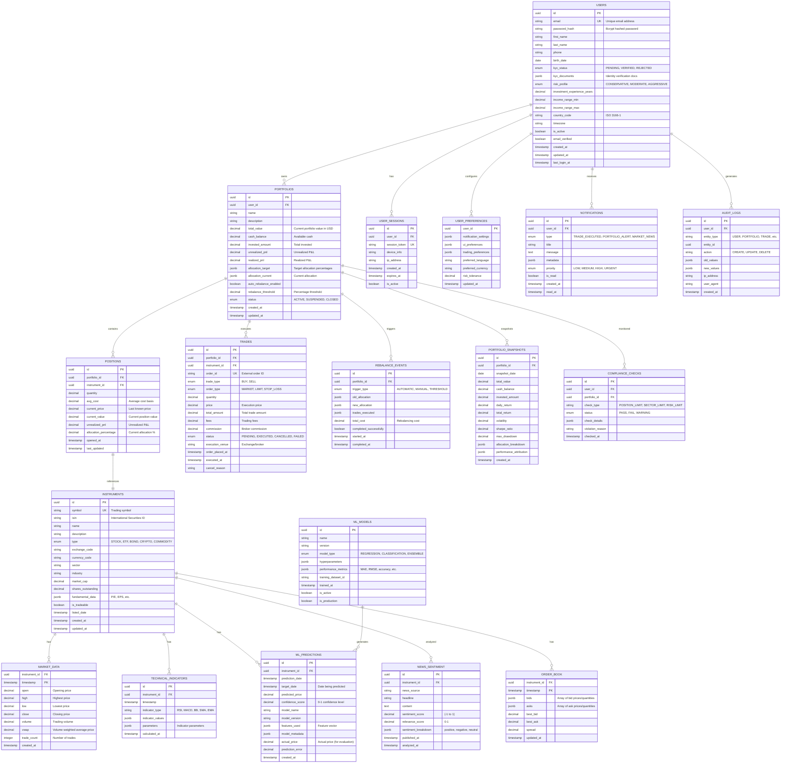

# Esquema de Base de Datos - TRII Platform

## 🗄️ Visión General

La plataforma TRII utiliza una arquitectura de datos híbrida que combina **PostgreSQL** para datos transaccionales, **TimescaleDB** para series temporales, y **Redis** para caché de alta velocidad.

## 📊 Diagrama Completo del Esquema



## 🕒 Esquema de TimescaleDB

### Tablas de Series Temporales

```sql
-- Market Data Hypertable (particionado por tiempo)
CREATE TABLE market_data (
    instrument_id UUID NOT NULL,
    timestamp TIMESTAMPTZ NOT NULL,
    open DECIMAL(20,8) NOT NULL,
    high DECIMAL(20,8) NOT NULL,
    low DECIMAL(20,8) NOT NULL,
    close DECIMAL(20,8) NOT NULL,
    volume DECIMAL(20,8) NOT NULL,
    vwap DECIMAL(20,8),
    trade_count INTEGER,
    created_at TIMESTAMPTZ DEFAULT NOW()
);

-- Convertir a hypertable con chunks de 1 día
SELECT create_hypertable('market_data', 'timestamp', chunk_time_interval => INTERVAL '1 day');

-- Índices optimizados
CREATE INDEX idx_market_data_instrument_time ON market_data (instrument_id, timestamp DESC);
CREATE INDEX idx_market_data_symbol_time ON market_data (instrument_id, timestamp DESC) 
    WHERE timestamp > NOW() - INTERVAL '7 days';

-- Políticas de retención automática
SELECT add_retention_policy('market_data', INTERVAL '2 years');

-- Compresión automática para datos antiguos
ALTER TABLE market_data SET (
    timescaledb.compress,
    timescaledb.compress_orderby = 'timestamp DESC',
    timescaledb.compress_segmentby = 'instrument_id'
);

SELECT add_compression_policy('market_data', INTERVAL '7 days');
```

### Continuous Aggregates (Vistas Materializadas)

```sql
-- Agregados por hora
CREATE MATERIALIZED VIEW market_data_hourly
WITH (timescaledb.continuous) AS
SELECT 
    instrument_id,
    time_bucket('1 hour', timestamp) AS bucket,
    first(open, timestamp) AS open,
    max(high) AS high,
    min(low) AS low,
    last(close, timestamp) AS close,
    sum(volume) AS volume,
    avg(close) AS avg_price,
    count(*) AS data_points
FROM market_data
GROUP BY instrument_id, bucket;

-- Refresh automático cada 10 minutos
SELECT add_continuous_aggregate_policy('market_data_hourly',
    start_offset => INTERVAL '1 day',
    end_offset => INTERVAL '10 minutes',
    schedule_interval => INTERVAL '10 minutes');

-- Agregados diarios
CREATE MATERIALIZED VIEW market_data_daily
WITH (timescaledb.continuous) AS
SELECT 
    instrument_id,
    time_bucket('1 day', timestamp) AS bucket,
    first(open, timestamp) AS open,
    max(high) AS high,
    min(low) AS low,
    last(close, timestamp) AS close,
    sum(volume) AS volume,
    (last(close, timestamp) - first(open, timestamp)) / first(open, timestamp) * 100 AS daily_return_pct
FROM market_data
GROUP BY instrument_id, bucket;
```

## ⚡ Esquema de Redis

### Estructura de Cache

```redis
# Market Data Cache (TTL: 1 segundo)
market:quote:{symbol} → {
    "price": 150.25,
    "change": 2.15,
    "change_pct": 1.45,
    "volume": 1234567,
    "timestamp": 1641234567890
}

# User Sessions (TTL: 24 horas)
session:{token} → {
    "user_id": "uuid",
    "expires_at": 1641234567890,
    "permissions": ["read", "write", "trade"],
    "last_activity": 1641234567890
}

# Portfolio Cache (TTL: 30 segundos)
portfolio:{user_id}:{portfolio_id} → {
    "total_value": 125000.50,
    "daily_return": 850.25,
    "positions": [...],
    "last_updated": 1641234567890
}

# ML Predictions Cache (TTL: 1 hora)
ml:prediction:{symbol}:{model_version} → {
    "predicted_price": 155.75,
    "confidence": 0.87,
    "target_date": "2026-01-12",
    "features": {...}
}

# Real-time Streams
stream:market_data → Redis Streams para WebSocket broadcasting
stream:notifications:{user_id} → Notificaciones en tiempo real
stream:portfolio_updates → Actualizaciones de portafolio
```

## 🔍 Índices y Optimizaciones

### Índices Críticos

```sql
-- Búsquedas de usuarios
CREATE INDEX idx_users_email ON users (email) WHERE is_active = true;
CREATE INDEX idx_users_kyc_status ON users (kyc_status) WHERE kyc_status = 'PENDING';

-- Consultas de portfolio
CREATE INDEX idx_portfolios_user_id ON portfolios (user_id) WHERE status = 'ACTIVE';
CREATE INDEX idx_positions_portfolio_instrument ON positions (portfolio_id, instrument_id);

-- Market data queries
CREATE INDEX idx_market_data_symbol_recent ON market_data (instrument_id, timestamp DESC) 
    WHERE timestamp > NOW() - INTERVAL '30 days';

-- Trading history
CREATE INDEX idx_trades_portfolio_date ON trades (portfolio_id, executed_at DESC);
CREATE INDEX idx_trades_status_date ON trades (status, executed_at) WHERE status = 'EXECUTED';

-- ML predictions
CREATE INDEX idx_ml_predictions_instrument_date ON ml_predictions (instrument_id, prediction_date DESC);
CREATE INDEX idx_ml_predictions_model ON ml_predictions (model_name, model_version) 
    WHERE prediction_date > NOW() - INTERVAL '7 days';
```

### Particionamiento

```sql
-- Particionamiento de audit_logs por mes
CREATE TABLE audit_logs_template (
    LIKE audit_logs INCLUDING ALL
) PARTITION BY RANGE (created_at);

-- Crear particiones automáticamente
CREATE OR REPLACE FUNCTION create_monthly_partition()
RETURNS void AS $$
DECLARE
    start_date date;
    end_date date;
    partition_name text;
BEGIN
    start_date := date_trunc('month', CURRENT_DATE);
    end_date := start_date + interval '1 month';
    partition_name := 'audit_logs_' || to_char(start_date, 'YYYY_MM');
    
    EXECUTE format('CREATE TABLE IF NOT EXISTS %I PARTITION OF audit_logs 
                    FOR VALUES FROM (%L) TO (%L)', 
                   partition_name, start_date, end_date);
END;
$$ LANGUAGE plpgsql;

-- Ejecutar mensualmente
SELECT cron.schedule('create-monthly-partition', '0 0 1 * *', 'SELECT create_monthly_partition()');
```

## 📊 Vistas y Funciones Útiles

### Vista de Portfolio Consolidado

```sql
CREATE VIEW v_portfolio_summary AS
SELECT 
    p.id,
    p.name,
    p.user_id,
    p.total_value,
    p.cash_balance,
    p.invested_amount,
    p.unrealized_pnl,
    COUNT(pos.id) as position_count,
    AVG(pos.allocation_percentage) as avg_allocation,
    MAX(pos.last_updated) as last_position_update,
    json_agg(
        json_build_object(
            'symbol', i.symbol,
            'quantity', pos.quantity,
            'current_value', pos.current_value,
            'pnl', pos.unrealized_pnl
        )
    ) as positions
FROM portfolios p
LEFT JOIN positions pos ON p.id = pos.portfolio_id
LEFT JOIN instruments i ON pos.instrument_id = i.id
WHERE p.status = 'ACTIVE'
GROUP BY p.id, p.name, p.user_id, p.total_value, p.cash_balance, p.invested_amount, p.unrealized_pnl;
```

### Función de Cálculo de Performance

```sql
CREATE OR REPLACE FUNCTION calculate_portfolio_performance(
    p_portfolio_id UUID,
    p_start_date DATE DEFAULT CURRENT_DATE - INTERVAL '30 days',
    p_end_date DATE DEFAULT CURRENT_DATE
)
RETURNS TABLE (
    total_return DECIMAL,
    annualized_return DECIMAL,
    volatility DECIMAL,
    sharpe_ratio DECIMAL,
    max_drawdown DECIMAL
) AS $$
DECLARE
    daily_returns DECIMAL[];
    avg_return DECIMAL;
    return_std DECIMAL;
    risk_free_rate DECIMAL := 0.03; -- 3% annual risk-free rate
BEGIN
    -- Obtener retornos diarios
    SELECT ARRAY_AGG(daily_return ORDER BY snapshot_date)
    INTO daily_returns
    FROM portfolio_snapshots 
    WHERE portfolio_id = p_portfolio_id 
    AND snapshot_date BETWEEN p_start_date AND p_end_date;
    
    -- Calcular métricas
    SELECT AVG(unnest), STDDEV(unnest)
    INTO avg_return, return_std
    FROM unnest(daily_returns);
    
    -- Retornar resultados
    RETURN QUERY
    SELECT 
        (SELECT daily_return FROM unnest(daily_returns) AS daily_return LIMIT 1) as total_return,
        avg_return * 252 as annualized_return, -- 252 trading days
        return_std * SQRT(252) as volatility,
        CASE 
            WHEN return_std > 0 THEN (avg_return * 252 - risk_free_rate) / (return_std * SQRT(252))
            ELSE 0 
        END as sharpe_ratio,
        -- Calcular max drawdown (simplificado)
        0.0 as max_drawdown;
END;
$$ LANGUAGE plpgsql;
```

## 🔒 Seguridad de Datos

### Row Level Security (RLS)

```sql
-- Habilitar RLS en tablas sensibles
ALTER TABLE portfolios ENABLE ROW LEVEL SECURITY;
ALTER TABLE positions ENABLE ROW LEVEL SECURITY;
ALTER TABLE trades ENABLE ROW LEVEL SECURITY;

-- Política: usuarios solo pueden ver sus propios datos
CREATE POLICY user_portfolios ON portfolios
    FOR ALL TO authenticated_user
    USING (user_id = current_setting('app.user_id')::UUID);

-- Política: admin puede ver todo
CREATE POLICY admin_all_portfolios ON portfolios
    FOR ALL TO admin_role
    USING (true);
```

### Encriptación de Datos Sensibles

```sql
-- Función para encriptar PII
CREATE EXTENSION IF NOT EXISTS pgcrypto;

CREATE OR REPLACE FUNCTION encrypt_pii(data TEXT)
RETURNS BYTEA AS $$
BEGIN
    RETURN pgp_sym_encrypt(data, current_setting('app.encryption_key'));
END;
$$ LANGUAGE plpgsql SECURITY DEFINER;

-- Trigger para encriptar automáticamente
CREATE TRIGGER encrypt_user_pii
    BEFORE INSERT OR UPDATE ON users
    FOR EACH ROW
    EXECUTE FUNCTION encrypt_sensitive_data();
```

## 📈 Métricas y Monitoring

### Queries de Monitoreo

```sql
-- Database size and growth
SELECT 
    schemaname,
    tablename,
    pg_size_pretty(pg_total_relation_size(schemaname||'.'||tablename)) as size,
    pg_stat_get_tuples_inserted(c.oid) as inserts,
    pg_stat_get_tuples_updated(c.oid) as updates,
    pg_stat_get_tuples_deleted(c.oid) as deletes
FROM pg_tables pt
JOIN pg_class c ON c.relname = pt.tablename
WHERE schemaname = 'public'
ORDER BY pg_total_relation_size(schemaname||'.'||tablename) DESC;

-- Active connections by user
SELECT 
    usename,
    application_name,
    client_addr,
    state,
    COUNT(*) as connection_count
FROM pg_stat_activity 
WHERE state = 'active'
GROUP BY usename, application_name, client_addr, state;

-- Slow queries
SELECT 
    query,
    mean_exec_time,
    calls,
    total_exec_time,
    rows,
    100.0 * shared_blks_hit / nullif(shared_blks_hit + shared_blks_read, 0) AS hit_percent
FROM pg_stat_statements 
ORDER BY mean_exec_time DESC 
LIMIT 10;
```

---

**Última actualización**: Enero 2026  
**Versión del Schema**: 2.1.0