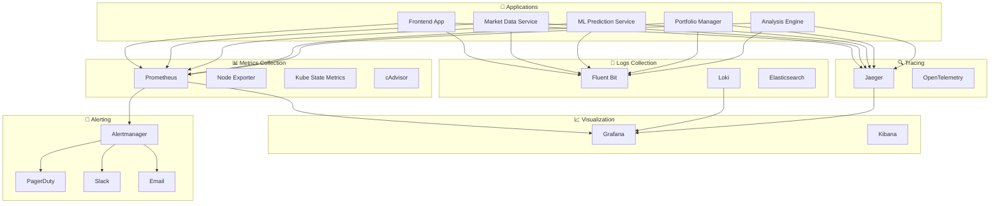

# Guía de Monitoreo y Observabilidad - TRII Platform

## 📊 Stack de Observabilidad

La plataforma TRII implementa un stack completo de observabilidad usando las mejores prácticas de la industria:



## 🎯 Métricas Clave (KPIs)

### 🏢 Métricas de Negocio

```yaml
# Usuarios Activos
trii_active_users_total: "Total de usuarios activos"
trii_new_registrations_total: "Registros nuevos por período"
trii_user_retention_rate: "Tasa de retención de usuarios"

# Ingresos y AUM
trii_aum_total_usd: "Activos bajo gestión en USD"
trii_revenue_total_usd: "Ingresos totales en USD"
trii_avg_portfolio_value_usd: "Valor promedio de portfolio"

# Trading
trii_trades_executed_total: "Trades ejecutados exitosamente"
trii_trading_volume_usd_total: "Volumen de trading en USD"
trii_avg_trade_size_usd: "Tamaño promedio de trade"

# Performance
trii_avg_portfolio_return_pct: "Retorno promedio de portfolios"
trii_successful_strategies_pct: "Porcentaje de estrategias exitosas"
```

### ⚡ Métricas Técnicas

```yaml
# API Performance
http_requests_total: "Total de requests HTTP"
http_request_duration_seconds: "Duración de requests"
http_requests_in_flight: "Requests concurrentes"

# Database
postgres_connections_active: "Conexiones activas a PostgreSQL"
postgres_query_duration_seconds: "Duración de queries"
postgres_slow_queries_total: "Queries lentas detectadas"

# Cache
redis_connected_clients: "Clientes conectados a Redis"
redis_keyspace_hits_total: "Cache hits"
redis_keyspace_misses_total: "Cache misses"

# ML Models
ml_inference_duration_seconds: "Tiempo de inferencia ML"
ml_prediction_accuracy: "Precisión de predicciones"
ml_model_drift_score: "Puntuación de drift del modelo"
```

## 📈 Dashboards de Grafana

### 🎯 Dashboard Principal: TRII Platform Overview

Este dashboard proporciona una vista general del estado de la plataforma:

**Ubicación**: http://trii-grafana.local/d/trii-overview

**Paneles Incluidos:**
- ✅ **Service Health Matrix**: Estado de todos los microservicios
- 📊 **Request Rate & Latency**: Throughput y latencia por servicio
- 💾 **Resource Usage**: CPU, memoria y disco por pod
- 👥 **Active Users**: Usuarios activos en tiempo real
- 💰 **Portfolio Metrics**: AUM, trades ejecutados, performance
- 🚨 **Error Rate**: Tasas de error por endpoint

### 🏢 Dashboard de Business Intelligence

**Variables:**
```yaml
$timeRange: Rango temporal seleccionable (1h, 24h, 7d, 30d)
$portfolio_id: ID específico de portfolio (opcional)
$user_segment: Segmento de usuario (all, premium, basic)
```

**Queries Clave:**
```promql
# Active Users
trii_active_users_total

# Portfolio Growth
increase(trii_aum_total_usd[24h])

# Trading Volume by Hour
rate(trii_trading_volume_usd_total[1h]) * 3600

# Average Portfolio Performance
avg(trii_portfolio_return_pct) by (risk_profile)

# User Registration Funnel
(
  rate(trii_user_signups_total[1h]) * 3600,
  rate(trii_user_verifications_total[1h]) * 3600,
  rate(trii_first_deposits_total[1h]) * 3600
)
```

### 🤖 Dashboard de ML Performance

**Paneles Especializados:**
- 🎯 **Model Accuracy Trends**: Precisión de modelos a lo largo del tiempo
- ⚡ **Inference Latency**: Tiempo de respuesta de predicciones
- 🔄 **Model Drift Detection**: Detección de degradación de modelos
- 📊 **Feature Importance**: Importancia de features en tiempo real
- 🧠 **A/B Test Results**: Comparación de modelos en producción

```promql
# Model Accuracy by Version
trii_ml_prediction_accuracy{model_version=~"v2.*"}

# Prediction Latency p95
histogram_quantile(0.95, 
  rate(trii_ml_inference_duration_seconds_bucket[5m])
)

# Data Drift Score
trii_ml_data_drift_score > 0.3

# Model Performance Comparison
(
  avg(trii_ml_accuracy{model="ensemble"}) by (model_version),
  avg(trii_ml_accuracy{model="lstm"}) by (model_version)
)
```

### 🛡️ Dashboard de Seguridad

```promql
# Failed Login Attempts
increase(trii_failed_login_attempts_total[1h])

# Suspicious Activities
trii_security_alerts_total{severity="high"}

# API Rate Limiting
rate(trii_rate_limit_exceeded_total[5m])

# Data Access Patterns
trii_data_access_unusual_patterns_total
```

## 🚨 Alertas y Notificaciones

### 📋 Alertas Críticas (Severity: Critical)

```yaml
# Servicio Completamente Caído
- alert: ServiceDown
  expr: up == 0
  for: 2m
  labels:
    severity: critical
    team: platform
  annotations:
    summary: "🚨 Servicio {{ $labels.job }} está completamente caído"
    description: "El servicio {{ $labels.job }} no responde desde hace más de 2 minutos."
    runbook: "https://runbooks.trii.co/service-down"
    dashboard: "http://trii-grafana.local/d/trii-overview"

# Error Rate Muy Alto
- alert: HighErrorRate
  expr: rate(http_requests_total{status=~"5.."}[5m]) / rate(http_requests_total[5m]) > 0.05
  for: 5m
  labels:
    severity: critical
  annotations:
    summary: "🔥 Alta tasa de errores en {{ $labels.service }}"
    description: "Error rate: {{ $value | humanizePercentage }}"

# Latencia Extrema
- alert: ExtremeLatency
  expr: histogram_quantile(0.95, rate(http_request_duration_seconds_bucket[5m])) > 5
  for: 3m
  labels:
    severity: critical
  annotations:
    summary: "🐌 Latencia extrema en {{ $labels.service }}"
    description: "P95 latency: {{ $value }}s"
```

### ⚠️ Alertas de Warning

```yaml
# Alto Uso de CPU
- alert: HighCPUUsage
  expr: rate(container_cpu_usage_seconds_total[5m]) > 0.8
  for: 10m
  labels:
    severity: warning
  annotations:
    summary: "⚡ Alto uso de CPU en {{ $labels.pod }}"
    description: "CPU usage: {{ $value | humanizePercentage }}"

# Alto Uso de Memoria
- alert: HighMemoryUsage
  expr: container_memory_usage_bytes / container_spec_memory_limit_bytes > 0.85
  for: 10m
  labels:
    severity: warning
```

### 📊 Alertas de Negocio

```yaml
# Caída Significativa en Trading Volume
- alert: TradingVolumeDropped
  expr: rate(trii_trading_volume_usd_total[1h]) < 0.5 * rate(trii_trading_volume_usd_total[1h] offset 1d)
  for: 30m
  labels:
    severity: warning
    team: business
  annotations:
    summary: "📉 Volumen de trading cayó significativamente"
    description: "Volume actual: ${{ $value }}/hora (50% menos que ayer)"

# Modelo ML con Baja Precisión
- alert: LowMLAccuracy
  expr: trii_ml_prediction_accuracy < 0.75
  for: 1h
  labels:
    severity: warning
    team: ml
  annotations:
    summary: "🤖 Precisión del modelo ML por debajo del umbral"
    description: "Accuracy: {{ $value | humanizePercentage }} (< 75%)"
```

## 📞 Canales de Notificación

### 🔧 Configuración de Alertmanager

```yaml
global:
  smtp_smarthost: 'smtp.gmail.com:587'
  smtp_from: 'alerts@trii.co'
  
route:
  group_by: ['alertname', 'severity']
  group_wait: 10s
  group_interval: 5m
  repeat_interval: 12h
  receiver: 'default'
  routes:
  - match:
      severity: critical
    receiver: 'critical-alerts'
    group_wait: 0s
  - match:
      team: ml
    receiver: 'ml-team'
  - match:
      team: platform
    receiver: 'platform-team'

receivers:
- name: 'default'
  email_configs:
  - to: 'alerts@trii.co'
    subject: '[TRII] {{ .GroupLabels.alertname }}'
    body: |
      {{ range .Alerts }}
      Alert: {{ .Annotations.summary }}
      Description: {{ .Annotations.description }}
      {{ end }}

- name: 'critical-alerts'
  pagerduty_configs:
  - service_key: 'your-pagerduty-key'
    description: '{{ .GroupLabels.alertname }}: {{ .CommonAnnotations.summary }}'
  slack_configs:
  - api_url: 'https://hooks.slack.com/services/YOUR/SLACK/WEBHOOK'
    channel: '#alerts-critical'
    title: '🚨 CRITICAL ALERT 🚨'
    text: '{{ .CommonAnnotations.summary }}'

- name: 'ml-team'
  slack_configs:
  - api_url: 'https://hooks.slack.com/services/YOUR/ML/WEBHOOK'
    channel: '#ml-alerts'
    title: '🤖 ML Alert'
    
- name: 'platform-team'
  slack_configs:
  - api_url: 'https://hooks.slack.com/services/YOUR/PLATFORM/WEBHOOK'
    channel: '#platform-alerts'
    title: '⚙️ Platform Alert'
```

## 🔍 Logging y Trazabilidad

### 📝 Estructura de Logs

Todos los servicios siguen un formato JSON estructurado:

```json
{
  "timestamp": "2026-01-11T15:30:00.123Z",
  "level": "INFO",
  "service": "market-data-service",
  "version": "2.1.0",
  "trace_id": "abc123def456",
  "span_id": "789ghi012",
  "user_id": "user_123456",
  "request_id": "req_789012",
  "message": "Market data fetched successfully",
  "data": {
    "symbol": "AAPL",
    "price": 192.53,
    "latency_ms": 45
  },
  "labels": {
    "environment": "production",
    "datacenter": "us-east-1"
  }
}
```

### 🔍 Queries de Loki

```promql
# Logs de errores por servicio
{service="market-data-service"} |= "ERROR"

# Logs de un usuario específico
{user_id="user_123456"} | json | level="ERROR"

# Logs con alta latencia
{service=~".*-service"} | json | latency_ms > 1000

# Trace de una request específica
{trace_id="abc123def456"}
```

### 🔗 Distributed Tracing

**Configuración de Jaeger:**
- **Sampling Rate**: 1% en producción, 100% en desarrollo
- **Retention**: 7 días para traces normales, 30 días para traces con errores
- **Tags Obligatorios**: user_id, service_version, environment

**Ejemplo de Trace:**
```
Request: GET /api/v1/portfolios/p_123456/summary
├── portfolio-manager-service (45ms)
│   ├── auth-validation (5ms)
│   ├── portfolio-db-query (25ms)
│   └── positions-calculation (15ms)
├── market-data-service (12ms)
│   ├── redis-cache-lookup (2ms)
│   └── price-aggregation (10ms)
└── ml-prediction-service (8ms)
    └── confidence-calculation (8ms)
Total Duration: 65ms
```

## 📊 Métricas Personalizadas

### 🔧 Implementación en Python (FastAPI)

```python
from prometheus_client import Counter, Histogram, Gauge, generate_latest
import time

# Métricas de negocio
TRADES_EXECUTED = Counter(
    'trii_trades_executed_total',
    'Total trades executed',
    ['symbol', 'trade_type', 'status']
)

PORTFOLIO_VALUE = Gauge(
    'trii_portfolio_value_usd',
    'Current portfolio value in USD',
    ['portfolio_id', 'user_id']
)

PREDICTION_ACCURACY = Histogram(
    'trii_ml_prediction_accuracy',
    'ML prediction accuracy score',
    ['model_name', 'symbol'],
    buckets=[0.5, 0.6, 0.7, 0.8, 0.9, 0.95, 0.99]
)

# Uso en el código
@app.post("/trades")
async def execute_trade(trade_request: TradeRequest):
    start_time = time.time()
    
    try:
        result = await trading_service.execute(trade_request)
        
        # Incrementar contador de trades exitosos
        TRADES_EXECUTED.labels(
            symbol=trade_request.symbol,
            trade_type=trade_request.type,
            status='success'
        ).inc()
        
        return result
        
    except Exception as e:
        # Incrementar contador de trades fallidos
        TRADES_EXECUTED.labels(
            symbol=trade_request.symbol,
            trade_type=trade_request.type,
            status='error'
        ).inc()
        
        raise
    
    finally:
        duration = time.time() - start_time
        REQUEST_DURATION.observe(duration)
```

### 📈 Implementación en Node.js

```javascript
const client = require('prom-client');

// Crear métricas
const httpRequestDuration = new client.Histogram({
  name: 'http_request_duration_seconds',
  help: 'HTTP request duration in seconds',
  labelNames: ['method', 'route', 'status_code'],
  buckets: [0.01, 0.05, 0.1, 0.5, 1, 5]
});

const activeConnections = new client.Gauge({
  name: 'websocket_connections_active',
  help: 'Number of active WebSocket connections',
  labelNames: ['type']
});

// Middleware para medir requests
app.use((req, res, next) => {
  const start = Date.now();
  
  res.on('finish', () => {
    const duration = (Date.now() - start) / 1000;
    httpRequestDuration
      .labels(req.method, req.route?.path || req.path, res.statusCode)
      .observe(duration);
  });
  
  next();
});
```

## 🧪 Synthetic Monitoring

### 🔍 Health Checks Automáticos

```yaml
# Kubernetes Liveness & Readiness Probes
livenessProbe:
  httpGet:
    path: /health/live
    port: 8080
  initialDelaySeconds: 30
  periodSeconds: 10
  timeoutSeconds: 5
  failureThreshold: 3

readinessProbe:
  httpGet:
    path: /health/ready
    port: 8080
  initialDelaySeconds: 5
  periodSeconds: 5
  timeoutSeconds: 3
  successThreshold: 1
  failureThreshold: 3
```

### 🧪 Tests Sintéticos con Grafana

```javascript
// K6 Script para testing sintético
import http from 'k6/http';
import { check } from 'k6';

export let options = {
  stages: [
    { duration: '1m', target: 10 },   // Ramp up
    { duration: '3m', target: 50 },   // Stay at 50 users
    { duration: '1m', target: 0 },    // Ramp down
  ],
  thresholds: {
    'http_req_duration': ['p(95)<500'], // 95% of requests under 500ms
    'http_req_failed': ['rate<0.01'],   // Less than 1% failures
  },
};

export default function() {
  let response = http.get('http://trii-frontend.local/api/v1/health');
  
  check(response, {
    'status is 200': (r) => r.status === 200,
    'response time < 500ms': (r) => r.timings.duration < 500,
    'has correct content': (r) => r.json().status === 'healthy',
  });
  
  // Test critical user journeys
  testUserLogin();
  testPortfolioView();
  testTradeExecution();
}

function testUserLogin() {
  let loginPayload = {
    email: 'test@example.com',
    password: 'test123'
  };
  
  let response = http.post(
    'http://trii-frontend.local/api/v1/auth/login',
    JSON.stringify(loginPayload),
    { headers: { 'Content-Type': 'application/json' } }
  );
  
  check(response, {
    'login successful': (r) => r.status === 200,
    'receives token': (r) => r.json().access_token !== undefined,
  });
}
```

## 📱 Mobile & Frontend Monitoring

### 🔧 Real User Monitoring (RUM)

```javascript
// Frontend error tracking
window.addEventListener('error', (event) => {
  // Send error to monitoring service
  fetch('/api/v1/telemetry/errors', {
    method: 'POST',
    headers: { 'Content-Type': 'application/json' },
    body: JSON.stringify({
      message: event.error.message,
      filename: event.filename,
      lineno: event.lineno,
      colno: event.colno,
      stack: event.error.stack,
      userAgent: navigator.userAgent,
      url: window.location.href,
      userId: currentUser?.id,
      timestamp: new Date().toISOString()
    })
  });
});

// Performance monitoring
const observer = new PerformanceObserver((list) => {
  for (const entry of list.getEntries()) {
    if (entry.entryType === 'navigation') {
      // Track page load times
      fetch('/api/v1/telemetry/performance', {
        method: 'POST',
        headers: { 'Content-Type': 'application/json' },
        body: JSON.stringify({
          url: entry.name,
          loadTime: entry.loadEventEnd - entry.loadEventStart,
          domContentLoaded: entry.domContentLoadedEventEnd - entry.domContentLoadedEventStart,
          firstPaint: entry.responseStart - entry.requestStart,
          userId: currentUser?.id
        })
      });
    }
  }
});

observer.observe({ entryTypes: ['navigation', 'resource'] });
```

## 🎯 SLIs & SLOs

### 📊 Service Level Indicators

```yaml
# Availability SLI
availability_sli:
  name: "Service Availability"
  query: "avg(up{job=~'trii-.*-service'})"
  target: 0.999  # 99.9%

# Latency SLI
latency_sli:
  name: "API Response Time"
  query: "histogram_quantile(0.95, rate(http_request_duration_seconds_bucket[5m]))"
  target: 0.2  # 200ms p95

# Error Rate SLI
error_rate_sli:
  name: "Error Rate"
  query: "rate(http_requests_total{status=~'5..'}[5m]) / rate(http_requests_total[5m])"
  target: 0.001  # 0.1%

# Throughput SLI
throughput_sli:
  name: "Request Throughput"
  query: "rate(http_requests_total[5m])"
  target: 1000  # 1000 req/s minimum
```

### 🎯 Service Level Objectives

| SLO | Target | Measurement Window | Error Budget |
|-----|--------|-------------------|--------------|
| **Availability** | 99.9% | 30 días | 43.8 minutos |
| **Latency (p95)** | < 200ms | 7 días | 5% de requests |
| **Error Rate** | < 0.1% | 24 horas | 0.1% de requests |
| **Data Freshness** | < 30s | Tiempo real | 1% del tiempo |

## 🔧 Runbooks y Procedimientos

### 📋 Runbook: Service Down

1. **Verificar Scope**:
   ```bash
   kubectl get pods -n trii-platform
   kubectl describe pod <failing-pod>
   ```

2. **Revisar Logs**:
   ```bash
   kubectl logs <failing-pod> --tail=100
   ```

3. **Verificar Dependencias**:
   - PostgreSQL: `kubectl exec -it postgres-pod -- pg_isready`
   - Redis: `kubectl exec -it redis-pod -- redis-cli ping`

4. **Restart si es necesario**:
   ```bash
   kubectl rollout restart deployment/<service-name>
   ```

### 📋 Runbook: High Memory Usage

1. **Identificar el pod**:
   ```bash
   kubectl top pods -n trii-platform --sort-by=memory
   ```

2. **Analizar memory leaks**:
   - Ver métricas históricas en Grafana
   - Revisar logs para OutOfMemoryError
   - Verificar garbage collection metrics

3. **Acciones correctivas**:
   - Aumentar memory limits temporalmente
   - Programar restart durante maintenance window
   - Escalar horizontalmente si es posible

---

**Contacto de Emergencia**: oncall@trii.co | +57-300-TRII-911  
**Última actualización**: Enero 2026