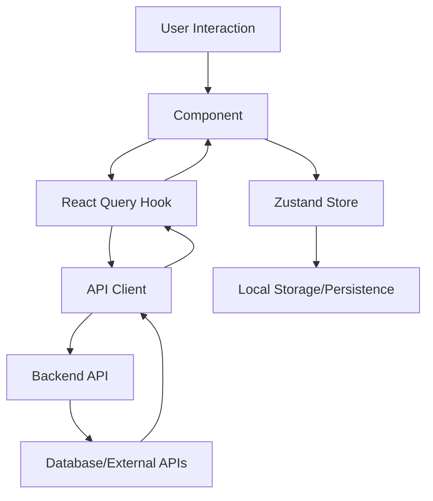

# Investment Recommendation App - Clean Architecture Plan

## Overview
This document outlines the clean architecture design for re-implementing the investment recommendation app using Next.js 16 with TypeScript. The design emphasizes modularity, scalability, and maintainability through feature-based organization and separation of concerns.

## Requirements
The app consists of five main pages with the following functionalities:

- **Landing Page**: Hero section, features overview, call-to-action for sign-up
- **Dashboard**: Portfolio summary, recent recommendations, market overview
- **Portfolio**: View/edit investments, performance charts, allocation breakdown
- **Watchlist**: Add/remove stocks, price alerts, basic analysis
- **Analysis**: Detailed stock analysis, technical indicators, fundamental data

## Technology Stack
- **Framework**: Next.js 16 (App Router)
- **Language**: TypeScript
- **Styling**: Tailwind CSS
- **UI Components**: shadcn/ui
- **State Management**: Zustand
- **Data Fetching**: React Query (TanStack Query)
- **Charts**: Recharts or Chart.js
- **Forms**: React Hook Form with Zod validation

## Directory Structure

```
apps/next-frontend/src/
├── app/                          # Next.js App Router
│   ├── globals.css
│   ├── layout.tsx
│   ├── page.tsx                  # Landing page
│   ├── dashboard/
│   │   └── page.tsx
│   ├── portfolio/
│   │   └── page.tsx
│   ├── watchlist/
│   │   └── page.tsx
│   └── analysis/
│       └── page.tsx
├── components/
│   ├── ui/                       # Reusable UI components (shadcn)
│   │   ├── button.tsx
│   │   ├── card.tsx
│   │   └── ...
│   ├── layout/
│   │   ├── Navigation.tsx
│   │   └── Header.tsx
│   └── features/                 # Feature-specific components
│       ├── dashboard/
│       │   ├── PortfolioSummary.tsx
│       │   ├── RecommendationsList.tsx
│       │   └── MarketOverview.tsx
│       ├── portfolio/
│       │   ├── InvestmentList.tsx
│       │   ├── PerformanceChart.tsx
│       │   └── AllocationChart.tsx
│       ├── watchlist/
│       │   ├── WatchlistTable.tsx
│       │   └── AddStockForm.tsx
│       └── analysis/
│           ├── StockAnalysis.tsx
│           ├── TechnicalIndicators.tsx
│           └── FundamentalData.tsx
├── lib/
│   ├── api/
│   │   ├── client.ts              # Enhanced API client
│   │   └── endpoints.ts           # API endpoint definitions
│   └── utils/
│       ├── formatters.ts
│       └── constants.ts
├── hooks/
│   ├── useInvestments.ts
│   ├── useRecommendations.ts
│   ├── useWatchlist.ts
│   └── useMarketData.ts
├── types/
│   ├── investment.ts
│   ├── recommendation.ts
│   ├── stock.ts
│   └── api.ts
├── stores/
│   ├── userStore.ts
│   ├── portfolioStore.ts
│   └── uiStore.ts
└── services/
    ├── analysisService.ts
    ├── marketDataService.ts
    └── notificationService.ts
```

## Key Components Organization

### Layout Components
- **Navigation**: Main navigation bar with links to all pages
- **Header**: Page-specific headers with breadcrumbs and actions

### Feature Components
Each feature has its own directory with related components:

- **Dashboard**: Summary cards, charts, and lists
- **Portfolio**: Investment management interface
- **Watchlist**: Stock tracking and alerts
- **Analysis**: Detailed analysis tools and visualizations

### UI Components
Reusable components from shadcn/ui library for consistent design.

## Data Flow and State Management

### Data Fetching
- **React Query**: Used for server state management
  - Automatic caching and background updates
  - Optimistic updates for mutations
  - Error handling and retry logic

### State Management
- **Zustand**: Lightweight state management for client state
  - User preferences and settings
  - UI state (modals, loading states)
  - Portfolio data synchronization

### Data Flow Diagram


## Integration Points

### Backend Services
- **Analysis Engine**: Core analysis functionality
  - Technical indicators
  - Fundamental analysis
  - Sentiment analysis
  - LLM insights

### External APIs
- **Market Data Providers**: Real-time and historical data
  - Stock prices and quotes
  - Market indices
  - News and sentiment data

### API Client Architecture
```typescript
// lib/api/client.ts
class ApiClient {
  private baseUrl: string;
  
  // Investments
  getInvestments()
  createInvestment()
  
  // Recommendations
  getRecommendations()
  
  // Analysis
  getStockAnalysis(symbol: string)
  getTechnicalIndicators(symbol: string)
  
  // Market Data
  getQuote(symbol: string)
  getHistoricalData(symbol: string)
}
```

## Feature Organization

### Landing Page
- Hero section with app value proposition
- Feature highlights
- Call-to-action for registration
- Testimonials or social proof

### Dashboard
- Portfolio performance overview
- Recent investment recommendations
- Market news and alerts
- Quick actions (add to watchlist, view analysis)

### Portfolio Management
- Investment holdings table
- Performance charts (line, pie for allocation)
- CRUD operations for investments
- Portfolio analytics (returns, volatility)

### Watchlist
- Stock symbols table with current prices
- Add/remove functionality
- Price alerts configuration
- Basic technical indicators

### Analysis Page
- Stock selection interface
- Technical analysis charts
- Fundamental data display
- Recommendation engine integration
- Export/share functionality

## Scalability Considerations

### Code Organization
- Feature-based slicing for easy maintenance
- Shared components in separate directories
- TypeScript for type safety and better DX

### Performance
- React Query for efficient data fetching
- Code splitting at route level
- Image optimization with Next.js
- Bundle analysis and optimization

### Testing Strategy
- Unit tests for utilities and hooks
- Integration tests for API calls
- E2E tests for critical user flows
- Component testing with React Testing Library

### Deployment
- Docker containerization
- Kubernetes orchestration (existing setup)
- CI/CD pipeline for automated testing and deployment

## Next Steps
1. Set up the new directory structure
2. Implement core types and API client
3. Create shared UI components
4. Build feature components iteratively
5. Integrate with backend services
6. Add authentication and user management
7. Implement testing and monitoring

This architecture provides a solid foundation for a scalable, maintainable investment recommendation app with clear separation of concerns and modular design.