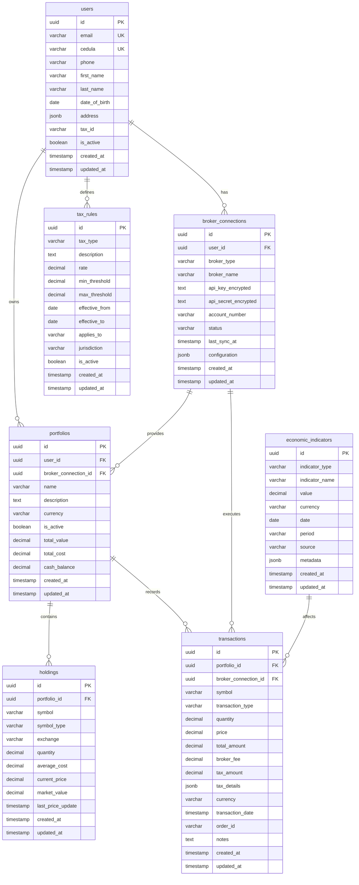
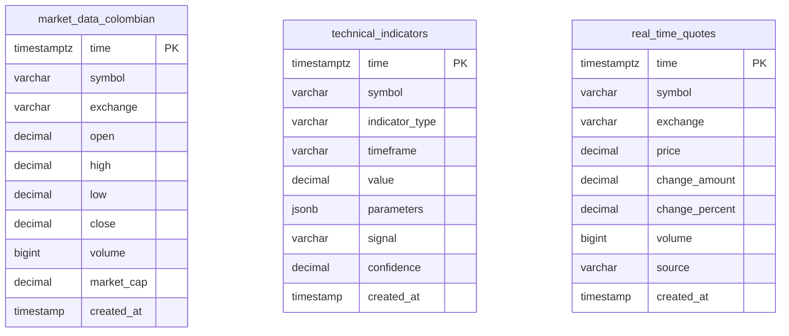

# TRII Platform Database Schema Design

## Overview

This document defines the complete database schema for the TRII investment platform, supporting Colombian market requirements with multi-broker integration and AI-driven recommendations.

### Database Architecture

- **PostgreSQL**: Relational data (users, portfolios, transactions, broker integrations)
- **TimescaleDB**: Time-series market data and technical indicators
- **MongoDB**: Flexible recommendation data and unstructured market information

## PostgreSQL Schema

### Core Tables

#### Users Table
```sql
CREATE TABLE users (
    id UUID PRIMARY KEY DEFAULT uuid_generate_v4(),
    email VARCHAR(255) UNIQUE NOT NULL,
    cedula VARCHAR(20) UNIQUE, -- Colombian ID number
    phone VARCHAR(20),
    first_name VARCHAR(100),
    last_name VARCHAR(100),
    date_of_birth DATE,
    address JSONB, -- Flexible address structure
    tax_id VARCHAR(20), -- Colombian tax ID (NIT)
    is_active BOOLEAN DEFAULT TRUE,
    email_verified BOOLEAN DEFAULT FALSE,
    phone_verified BOOLEAN DEFAULT FALSE,
    created_at TIMESTAMPTZ DEFAULT NOW(),
    updated_at TIMESTAMPTZ DEFAULT NOW()
);

-- Indexes
CREATE UNIQUE INDEX idx_users_email ON users(email);
CREATE UNIQUE INDEX idx_users_cedula ON users(cedula);
CREATE INDEX idx_users_tax_id ON users(tax_id);
```

#### Broker Connections Table
```sql
CREATE TABLE broker_connections (
    id UUID PRIMARY KEY DEFAULT uuid_generate_v4(),
    user_id UUID NOT NULL REFERENCES users(id) ON DELETE CASCADE,
    broker_type VARCHAR(50) NOT NULL, -- 'TRII', 'BVC', 'INTERACTIVE_BROKERS', etc.
    broker_name VARCHAR(100),
    api_key_encrypted TEXT, -- Encrypted API key
    api_secret_encrypted TEXT, -- Encrypted API secret
    access_token_encrypted TEXT, -- For OAuth flows
    refresh_token_encrypted TEXT, -- For token refresh
    token_expires_at TIMESTAMPTZ,
    account_number VARCHAR(50), -- Broker account number
    status VARCHAR(20) DEFAULT 'ACTIVE' CHECK (status IN ('ACTIVE', 'INACTIVE', 'ERROR', 'PENDING_VERIFICATION')),
    last_sync_at TIMESTAMPTZ,
    sync_status VARCHAR(20) DEFAULT 'IDLE',
    error_message TEXT,
    configuration JSONB, -- Broker-specific settings
    created_at TIMESTAMPTZ DEFAULT NOW(),
    updated_at TIMESTAMPTZ DEFAULT NOW()
);

-- Indexes
CREATE INDEX idx_broker_connections_user_id ON broker_connections(user_id);
CREATE INDEX idx_broker_connections_broker_type ON broker_connections(broker_type);
CREATE UNIQUE INDEX idx_broker_connections_user_broker ON broker_connections(user_id, broker_type, account_number);
```

#### Portfolios Table
```sql
CREATE TABLE portfolios (
    id UUID PRIMARY KEY DEFAULT uuid_generate_v4(),
    user_id UUID NOT NULL REFERENCES users(id) ON DELETE CASCADE,
    broker_connection_id UUID REFERENCES broker_connections(id) ON DELETE SET NULL,
    name VARCHAR(255) NOT NULL,
    description TEXT,
    currency VARCHAR(3) DEFAULT 'COP' CHECK (currency IN ('COP', 'USD', 'EUR')),
    is_active BOOLEAN DEFAULT TRUE,
    is_default BOOLEAN DEFAULT FALSE,
    total_value DECIMAL(20, 2) DEFAULT 0,
    total_cost DECIMAL(20, 2) DEFAULT 0,
    cash_balance DECIMAL(20, 2) DEFAULT 0,
    unrealized_pnl DECIMAL(20, 2) DEFAULT 0,
    realized_pnl DECIMAL(20, 2) DEFAULT 0,
    created_at TIMESTAMPTZ DEFAULT NOW(),
    updated_at TIMESTAMPTZ DEFAULT NOW()
);

-- Indexes
CREATE INDEX idx_portfolios_user_id ON portfolios(user_id);
CREATE INDEX idx_portfolios_broker_connection ON portfolios(broker_connection_id);
CREATE UNIQUE INDEX idx_portfolios_user_default ON portfolios(user_id) WHERE is_default = TRUE;
```

#### Holdings Table
```sql
CREATE TABLE holdings (
    id UUID PRIMARY KEY DEFAULT uuid_generate_v4(),
    portfolio_id UUID NOT NULL REFERENCES portfolios(id) ON DELETE CASCADE,
    symbol VARCHAR(20) NOT NULL,
    symbol_type VARCHAR(20) DEFAULT 'STOCK' CHECK (symbol_type IN ('STOCK', 'ETF', 'BOND', 'CRYPTO', 'FUND')),
    exchange VARCHAR(10) DEFAULT 'BVC', -- BVC, NYSE, NASDAQ, etc.
    quantity DECIMAL(20, 8) NOT NULL DEFAULT 0,
    available_quantity DECIMAL(20, 8) NOT NULL DEFAULT 0, -- For margin/short positions
    average_cost DECIMAL(20, 4) NOT NULL,
    current_price DECIMAL(20, 4),
    market_value DECIMAL(20, 2),
    unrealized_pnl DECIMAL(20, 2),
    unrealized_pnl_percent DECIMAL(10, 4),
    last_price_update TIMESTAMPTZ,
    cost_basis_method VARCHAR(20) DEFAULT 'FIFO' CHECK (cost_basis_method IN ('FIFO', 'LIFO', 'AVERAGE')),
    created_at TIMESTAMPTZ DEFAULT NOW(),
    updated_at TIMESTAMPTZ DEFAULT NOW()
);

-- Indexes
CREATE UNIQUE INDEX idx_holdings_portfolio_symbol ON holdings(portfolio_id, symbol);
CREATE INDEX idx_holdings_symbol ON holdings(symbol);
CREATE INDEX idx_holdings_portfolio_id ON holdings(portfolio_id);
```

#### Transactions Table
```sql
CREATE TABLE transactions (
    id UUID PRIMARY KEY DEFAULT uuid_generate_v4(),
    portfolio_id UUID NOT NULL REFERENCES portfolios(id) ON DELETE CASCADE,
    broker_connection_id UUID REFERENCES broker_connections(id),
    symbol VARCHAR(20) NOT NULL,
    symbol_type VARCHAR(20) DEFAULT 'STOCK',
    exchange VARCHAR(10) DEFAULT 'BVC',
    transaction_type VARCHAR(20) NOT NULL CHECK (transaction_type IN ('BUY', 'SELL', 'DIVIDEND', 'INTEREST', 'FEE', 'TAX', 'ADJUSTMENT')),
    quantity DECIMAL(20, 8) NOT NULL,
    price DECIMAL(20, 4), -- NULL for dividends, fees, etc.
    total_amount DECIMAL(20, 2) NOT NULL,
    broker_fee DECIMAL(20, 2) DEFAULT 0,
    exchange_fee DECIMAL(20, 2) DEFAULT 0,
    tax_amount DECIMAL(20, 2) DEFAULT 0, -- IVA, retenciones, etc.
    tax_details JSONB, -- Breakdown of taxes (IVA, retencion_fuente, etc.)
    currency VARCHAR(3) DEFAULT 'COP',
    transaction_date TIMESTAMPTZ NOT NULL,
    settlement_date TIMESTAMPTZ,
    order_id VARCHAR(100), -- Broker's order ID
    execution_id VARCHAR(100), -- Broker's execution ID
    notes TEXT,
    created_at TIMESTAMPTZ DEFAULT NOW(),
    updated_at TIMESTAMPTZ DEFAULT NOW()
);

-- Indexes
CREATE INDEX idx_transactions_portfolio_id ON transactions(portfolio_id);
CREATE INDEX idx_transactions_symbol ON transactions(symbol);
CREATE INDEX idx_transactions_transaction_date ON transactions(transaction_date DESC);
CREATE INDEX idx_transactions_broker_connection ON transactions(broker_connection_id);
CREATE INDEX idx_transactions_type_date ON transactions(transaction_type, transaction_date DESC);
```

#### Economic Indicators Table (Colombian Market Specific)
```sql
CREATE TABLE economic_indicators (
    id UUID PRIMARY KEY DEFAULT uuid_generate_v4(),
    indicator_type VARCHAR(50) NOT NULL, -- 'TRM', 'IPC', 'PIB', 'TASA_INTERES', 'INFLACION'
    indicator_name VARCHAR(100),
    value DECIMAL(20, 6) NOT NULL,
    currency VARCHAR(3) DEFAULT 'COP',
    date DATE NOT NULL,
    period VARCHAR(20), -- 'DAILY', 'MONTHLY', 'QUARTERLY', 'YEARLY'
    source VARCHAR(100) DEFAULT 'BANCO_DE_LA_REPUBLICA',
    metadata JSONB, -- Additional indicator-specific data
    created_at TIMESTAMPTZ DEFAULT NOW(),
    updated_at TIMESTAMPTZ DEFAULT NOW()
);

-- Indexes
CREATE UNIQUE INDEX idx_economic_indicators_type_date ON economic_indicators(indicator_type, date);
CREATE INDEX idx_economic_indicators_type ON economic_indicators(indicator_type);
CREATE INDEX idx_economic_indicators_date ON economic_indicators(date DESC);
```

#### Tax Rules Table (Colombian Tax Calculations)
```sql
CREATE TABLE tax_rules (
    id UUID PRIMARY KEY DEFAULT uuid_generate_v4(),
    tax_type VARCHAR(50) NOT NULL, -- 'IVA', 'RETENCION_FUENTE', 'RETENCION_ICA', 'GMF'
    description TEXT,
    rate DECIMAL(10, 6) NOT NULL, -- Tax rate as decimal (0.19 for 19% IVA)
    min_threshold DECIMAL(20, 2) DEFAULT 0,
    max_threshold DECIMAL(20, 2),
    effective_from DATE NOT NULL,
    effective_to DATE,
    applies_to VARCHAR(50), -- 'DIVIDENDS', 'INTEREST', 'CAPITAL_GAINS', 'ALL'
    jurisdiction VARCHAR(50) DEFAULT 'COLOMBIA',
    is_active BOOLEAN DEFAULT TRUE,
    created_at TIMESTAMPTZ DEFAULT NOW(),
    updated_at TIMESTAMPTZ DEFAULT NOW()
);

-- Indexes
CREATE INDEX idx_tax_rules_type ON tax_rules(tax_type);
CREATE INDEX idx_tax_rules_effective_dates ON tax_rules(effective_from, effective_to);
```

## TimescaleDB Schema

### Hypertables for Time-Series Data

#### Colombian Market Data
```sql
CREATE TABLE market_data_colombian (
    time TIMESTAMPTZ NOT NULL,
    symbol VARCHAR(20) NOT NULL,
    exchange VARCHAR(10) DEFAULT 'BVC',
    open DECIMAL(20, 4),
    high DECIMAL(20, 4),
    low DECIMAL(20, 4),
    close DECIMAL(20, 4),
    volume BIGINT,
    market_cap DECIMAL(20, 2),
    turnover DECIMAL(20, 2),
    bid DECIMAL(20, 4),
    ask DECIMAL(20, 4),
    bid_volume BIGINT,
    ask_volume BIGINT,
    created_at TIMESTAMPTZ DEFAULT NOW()
);

-- Convert to TimescaleDB hypertable
SELECT create_hypertable('market_data_colombian', 'time', chunk_time_interval => INTERVAL '1 day');

-- Indexes
CREATE INDEX idx_market_data_symbol_time ON market_data_colombian(symbol, time DESC);
CREATE INDEX idx_market_data_exchange_time ON market_data_colombian(exchange, time DESC);
```

#### Technical Indicators
```sql
CREATE TABLE technical_indicators (
    time TIMESTAMPTZ NOT NULL,
    symbol VARCHAR(20) NOT NULL,
    indicator_type VARCHAR(50) NOT NULL, -- 'SMA', 'EMA', 'RSI', 'MACD', 'BOLLINGER', etc.
    timeframe VARCHAR(10) NOT NULL, -- '1m', '5m', '15m', '1h', '1d', etc.
    value DECIMAL(20, 6) NOT NULL,
    parameters JSONB, -- Indicator parameters used
    signal VARCHAR(20), -- 'BUY', 'SELL', 'HOLD', 'NEUTRAL'
    confidence DECIMAL(5, 4), -- 0.0 to 1.0
    created_at TIMESTAMPTZ DEFAULT NOW()
);

-- Convert to TimescaleDB hypertable
SELECT create_hypertable('technical_indicators', 'time', chunk_time_interval => INTERVAL '1 hour');

-- Indexes
CREATE INDEX idx_technical_indicators_symbol_time ON technical_indicators(symbol, time DESC);
CREATE INDEX idx_technical_indicators_type ON technical_indicators(indicator_type);
CREATE INDEX idx_technical_indicators_timeframe ON technical_indicators(timeframe);
```

#### Real-time Quotes
```sql
CREATE TABLE real_time_quotes (
    time TIMESTAMPTZ NOT NULL,
    symbol VARCHAR(20) NOT NULL,
    exchange VARCHAR(10) DEFAULT 'BVC',
    price DECIMAL(20, 4) NOT NULL,
    change_amount DECIMAL(20, 4),
    change_percent DECIMAL(10, 4),
    volume BIGINT,
    bid DECIMAL(20, 4),
    ask DECIMAL(20, 4),
    bid_size BIGINT,
    ask_size BIGINT,
    last_trade_time TIMESTAMPTZ,
    source VARCHAR(50) NOT NULL, -- 'BVC', 'YAHOO', 'ALPHA_VANTAGE', etc.
    created_at TIMESTAMPTZ DEFAULT NOW()
);

-- Convert to TimescaleDB hypertable
SELECT create_hypertable('real_time_quotes', 'time', chunk_time_interval => INTERVAL '1 minute');

-- Indexes
CREATE INDEX idx_real_time_quotes_symbol_time ON real_time_quotes(symbol, time DESC);
CREATE INDEX idx_real_time_quotes_source ON real_time_quotes(source);
```

## MongoDB Collections

### Recommendations Collection
```javascript
// Flexible schema for AI-driven recommendations
{
  _id: ObjectId,
  user_id: UUID, // Reference to PostgreSQL users.id
  portfolio_id: UUID, // Optional, portfolio-specific recommendations
  symbol: String,
  symbol_type: String, // 'STOCK', 'ETF', etc.
  exchange: String, // 'BVC', 'NYSE', etc.
  action: String, // 'BUY', 'HOLD', 'SELL', 'AVOID'
  confidence: Number, // 0.0 to 1.0
  target_price: Number,
  stop_loss: Number,
  time_horizon: String, // 'SHORT', 'MEDIUM', 'LONG'
  reasoning: {
    technical: String,
    fundamental: String,
    sentiment: String,
    risk_factors: [String],
    market_context: String
  },
  model_metadata: {
    model_name: String,
    model_version: String,
    training_date: Date,
    features_used: [String],
    hyperparameters: Object
  },
  market_data_snapshot: {
    current_price: Number,
    volume: Number,
    market_cap: Number,
    pe_ratio: Number,
    // ... other relevant metrics
  },
  colombian_context: {
    trm_at_recommendation: Number,
    inflation_rate: Number,
    interest_rate: Number,
    sector_performance: String
  },
  expires_at: Date,
  created_at: Date,
  updated_at: Date
}

// Indexes
db.recommendations.createIndex({ user_id: 1, symbol: 1, created_at: -1 });
db.recommendations.createIndex({ action: 1, confidence: -1 });
db.recommendations.createIndex({ expires_at: 1 }, { expireAfterSeconds: 0 });
db.recommendations.createIndex({ symbol: 1, created_at: -1 });
```

### Market News Collection
```javascript
// Unstructured market information
{
  _id: ObjectId,
  title: String,
  content: String,
  summary: String,
  source: String, // 'PORTAFOLIO', 'EL_TIEMPO', 'BLOOMBERG', etc.
  url: String,
  published_at: Date,
  symbols_mentioned: [String], // ['ECOPETROL.CL', 'BANCOLOMBIA.CL']
  sentiment: {
    score: Number, // -1.0 to 1.0
    magnitude: Number,
    confidence: Number
  },
  categories: [String], // ['ECONOMY', 'POLITICS', 'COMMODITIES']
  tags: [String],
  language: String, // 'es', 'en'
  region: String, // 'COLOMBIA', 'LATAM', 'GLOBAL'
  author: String,
  extracted_entities: {
    organizations: [String],
    persons: [String],
    locations: [String],
    monetary_values: [{
      amount: Number,
      currency: String
    }]
  },
  processed_at: Date,
  created_at: Date
}

// Indexes
db.market_news.createIndex({ symbols_mentioned: 1, published_at: -1 });
db.market_news.createIndex({ sentiment_score: -1, published_at: -1 });
db.market_news.createIndex({ categories: 1, published_at: -1 });
db.market_news.createIndex({ published_at: -1 });
db.market_news.createIndex({ source: 1, published_at: -1 });
```

### Sentiment Analysis Collection
```javascript
{
  _id: ObjectId,
  symbol: String,
  date: Date,
  timeframe: String, // 'DAILY', 'HOURLY', 'REALTIME'
  overall_sentiment: {
    score: Number, // -1.0 to 1.0
    confidence: Number,
    magnitude: Number
  },
  sources_breakdown: {
    news: { score: Number, count: Number },
    social_media: { score: Number, count: Number },
    analyst_reports: { score: Number, count: Number },
    forums: { score: Number, count: Number }
  },
  trending_topics: [{
    topic: String,
    sentiment: Number,
    volume: Number
  }],
  colombian_context: {
    economic_indicators_impact: Number,
    political_events: [String],
    sector_sentiment: Number
  },
  raw_data: {
    news_articles_count: Number,
    social_posts_count: Number,
    analyst_reports_count: Number
  },
  created_at: Date
}

// Indexes
db.sentiment_analysis.createIndex({ symbol: 1, date: -1 });
db.sentiment_analysis.createIndex({ date: -1 });
db.sentiment_analysis.createIndex({ overall_sentiment_score: -1 });
```

### User Preferences Collection
```javascript
{
  _id: ObjectId,
  user_id: UUID,
  investment_profile: {
    risk_tolerance: String, // 'CONSERVATIVE', 'MODERATE', 'AGGRESSIVE'
    investment_horizon: String, // 'SHORT', 'MEDIUM', 'LONG'
    preferred_sectors: [String],
    excluded_sectors: [String],
    preferred_instruments: [String], // 'STOCKS', 'BONDS', 'ETFS'
    max_single_position_percent: Number,
    min_diversification_score: Number
  },
  notification_settings: {
    email_alerts: Boolean,
    push_notifications: Boolean,
    sms_alerts: Boolean,
    alert_types: {
      price_alerts: Boolean,
      portfolio_alerts: Boolean,
      recommendation_alerts: Boolean,
      market_news_alerts: Boolean
    },
    frequency: String // 'IMMEDIATE', 'DAILY', 'WEEKLY'
  },
  ui_preferences: {
    theme: String, // 'LIGHT', 'DARK', 'AUTO'
    language: String, // 'es', 'en'
    timezone: String,
    currency_display: String, // 'COP', 'USD'
    chart_preferences: Object
  },
  colombian_tax_settings: {
    tax_residence: String, // 'COLOMBIA', 'FOREIGN'
    tax_category: String, // 'PERSONA_NATURAL', 'PERSONA_JURIDICA'
    withhold_tax_percent: Number,
    iva_exempt: Boolean
  },
  created_at: Date,
  updated_at: Date
}

// Indexes
db.user_preferences.createIndex({ user_id: 1 }, { unique: true });
```

## ER Diagrams

### PostgreSQL Relationships



### TimescaleDB Relationships



## Indexing Strategies

### PostgreSQL Indexes

1. **Users Table**:
   - Unique indexes on email, cedula, tax_id for fast lookups
   - Partial index on active users if needed

2. **Broker Connections**:
   - Composite index on (user_id, broker_type, account_number) for uniqueness
   - Index on status for filtering active connections

3. **Portfolios**:
   - Index on user_id for user's portfolios
   - Partial unique index on default portfolio per user
   - Index on broker_connection_id for broker-specific portfolios

4. **Holdings**:
   - Unique composite index on (portfolio_id, symbol)
   - Index on symbol for cross-portfolio queries
   - Index on portfolio_id for portfolio holdings

5. **Transactions**:
   - Index on portfolio_id for portfolio transaction history
   - Index on transaction_date DESC for time-based queries
   - Composite index on (transaction_type, transaction_date) for filtering
   - Index on symbol for symbol-specific transactions

6. **Economic Indicators**:
   - Unique composite index on (indicator_type, date)
   - Index on date DESC for latest values
   - Index on indicator_type for indicator-specific queries

### TimescaleDB Indexes

1. **Market Data**:
   - Time-based partitioning with symbol as additional dimension
   - Composite index on (symbol, time DESC) for time-series queries
   - Index on exchange for market-specific queries

2. **Technical Indicators**:
   - Composite index on (symbol, time DESC) for symbol time-series
   - Index on indicator_type for indicator-specific queries
   - Index on timeframe for timeframe filtering

3. **Real-time Quotes**:
   - Composite index on (symbol, time DESC) for latest quotes
   - Index on source for data source filtering

### MongoDB Indexes

1. **Recommendations**:
   - Compound index on (user_id, symbol, created_at) for user recommendations
   - Index on expires_at with TTL for automatic cleanup
   - Index on action and confidence for filtering

2. **Market News**:
   - Multikey index on symbols_mentioned for symbol-based news
   - Index on published_at DESC for chronological sorting
   - Compound index on (categories, published_at) for category filtering

3. **Sentiment Analysis**:
   - Compound index on (symbol, date) for symbol-specific sentiment
   - Index on date for time-based queries
   - Index on overall_sentiment.score for ranking

## Colombian Market Specifics

### Currency Handling
- Primary currency: COP (Colombian Peso)
- TRM (Tipo de Cambio Representativo del Mercado) for USD/COP conversion
- Support for multi-currency portfolios (COP, USD, EUR)

### Tax Calculations
- IVA (Impuesto al Valor Agregado): 19% on most transactions
- Retención en la fuente: Variable rates based on income type
- Retención ICA: Local industry tax
- GMF (Gravamen a los Movimientos Financieros): 0.4% on withdrawals

### BVC Integration
- Primary exchange: Bolsa de Valores de Colombia (BVC)
- COLCAP index tracking
- Colombian stock symbols (e.g., ECOPETROL.CL, BANCOLOMBIA.CL)
- Support for different instrument types (acciones, ETF, bonos)

### Economic Indicators
- TRM: Daily USD/COP exchange rate
- IPC: Consumer Price Index (inflation)
- PIB: Gross Domestic Product
- Tasa de interés: Central bank interest rate
- Inflación: Monthly inflation rate

### Regulatory Compliance
- Colombian financial regulations compliance
- Data residency requirements
- Audit logging for all financial transactions
- Colombian ID (cédula) verification

## Performance Optimization

### Partitioning Strategy
- TimescaleDB automatic partitioning by time chunks
- PostgreSQL table partitioning for large transaction tables by date
- MongoDB sharding by user_id for recommendations

### Caching Strategy
- Redis for real-time market data
- Redis for user sessions and JWT tokens
- Redis for computed portfolio values

### Query Optimization
- Materialized views for complex portfolio calculations
- Pre-computed tax calculations
- Batch processing for bulk data imports

## Data Migration Strategy

### From Current Schema
1. Migrate existing users with Colombian ID fields
2. Convert portfolios to new structure with broker connections
3. Transform transactions with tax calculations
4. Migrate market data to TimescaleDB hypertables

### Data Validation
- Validate Colombian ID formats
- Verify tax calculations
- Ensure currency conversions are accurate
- Validate BVC symbol formats

## Monitoring and Maintenance

### Backup Strategy
- PostgreSQL: Daily backups with WAL archiving
- TimescaleDB: Continuous data retention policies
- MongoDB: Replica set with oplog backups

### Data Retention
- Market data: 5 years for daily, 1 year for intraday
- Transactions: Indefinite retention for regulatory compliance
- Recommendations: 30 days with automatic cleanup
- Audit logs: 7 years minimum

This schema provides a robust foundation for the TRII platform, supporting Colombian market requirements while enabling multi-broker integration and AI-driven recommendations.