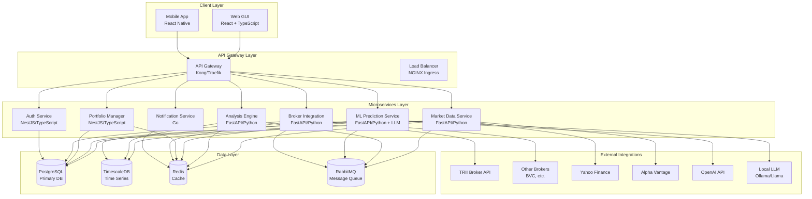
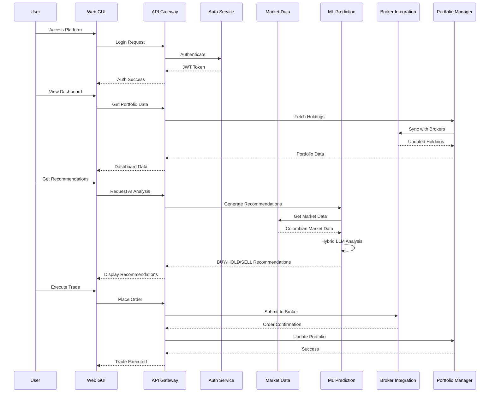
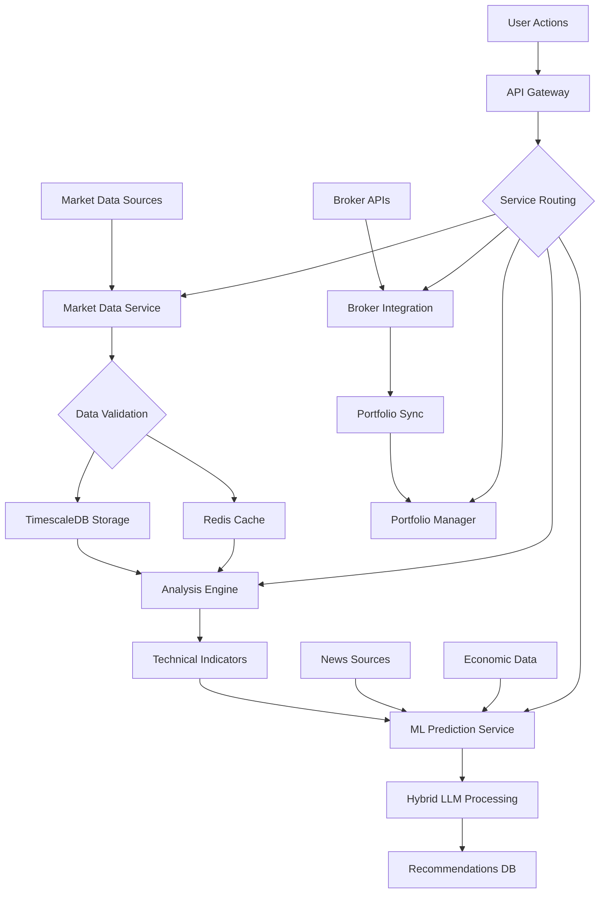

# TRII Investment Platform - Complete System Architecture

## Executive Summary

This document defines the complete system architecture for the redesigned TRII investment platform, transforming the existing desktop application into a cloud-based web platform with robust microservices architecture, Kubernetes deployment via Kind cluster with ArgoCD, and advanced AI/LLM capabilities for Colombian and Latin American markets.

## 1. Architecture Overview

### System Architecture Pattern
**Event-Driven Microservices with CQRS on Kubernetes** - Optimized for real-time financial data processing, scalable AI recommendations, and multi-broker integration.



## 2. Technology Stack Justification

### Frontend (Web GUI)
**Next.js 14 + React 18 + TypeScript + TailwindCSS**
- **Next.js**: Full-stack React framework with SSR/SSG for SEO and performance
- **React 18**: Latest React with concurrent features
- **TypeScript**: Type safety for financial calculations
- **TailwindCSS**: Utility-first CSS for rapid UI development
- **TradingView Lightweight Charts**: Industry-standard financial charting
- **Zustand**: Lightweight state management
- **React Query**: Server state management and caching

**Justification**: Next.js provides excellent SEO for financial content, TypeScript ensures calculation accuracy, TradingView charts are industry standard. TailwindCSS enables rapid prototyping while maintaining design consistency.

### Backend Services

#### Core API Services (FastAPI/Python)
- **Market Data Service**: Real-time data aggregation
- **Analysis Engine Service**: Technical analysis and indicators
- **ML Prediction Service**: AI recommendations with hybrid LLM
- **Broker Integration Service**: Colombian/Latin American broker APIs

**Justification**: Python dominates financial computing with pandas, numpy, scikit-learn. FastAPI provides async performance critical for real-time data processing.

#### Supporting Services
**NestJS (Node.js + TypeScript)**
- **Portfolio Manager Service**: Portfolio tracking and management
- **Auth Service**: Authentication and authorization

**Justification**: Excellent for CRUD operations and enterprise patterns. TypeScript ensures type safety across the stack.

**Go**
- **Notification Service**: High-throughput notifications

**Justification**: Superior performance for concurrent operations and low latency requirements.

### AI/LLM Stack
**Hybrid Approach: OpenAI + Local Models**
- **OpenAI GPT-4**: Advanced reasoning and market analysis
- **Local Models (Ollama/Llama 3)**: Privacy-preserving, offline capabilities
- **LangChain**: LLM orchestration and prompt engineering
- **Vector Databases**: Pinecone/Chroma for document retrieval

**Justification**: OpenAI provides state-of-the-art capabilities, local models ensure data privacy and offline operation for Colombian market regulations.

### Data Layer

#### Primary Database
**PostgreSQL 15+ with Extensions**
- User profiles and authentication
- Portfolio holdings and transactions
- Broker integration configurations
- Colombian market-specific data

**Justification**: ACID compliance critical for financial transactions. Excellent JSON support for flexible data structures.

#### Time-Series Database
**TimescaleDB (PostgreSQL extension)**
- OHLCV data for Colombian and international markets
- Technical indicators history
- ML model predictions log

**Justification**: Purpose-built for financial time-series data with excellent compression and query performance.

#### Caching & Session Store
**Redis 7+**
- Real-time market data cache
- User sessions and JWT tokens
- Rate limiting and API throttling

**Justification**: Sub-millisecond latency critical for real-time trading data.

### Infrastructure

#### Container Orchestration
**Kubernetes (Kind cluster)**
- Local development and testing
- Production-ready container orchestration
- Auto-scaling and self-healing

#### GitOps
**ArgoCD**
- Declarative deployment
- Automated synchronization
- Rollback capabilities
- Multi-environment management

**Justification**: Industry standard for Kubernetes deployments, enables reliable and auditable deployments.

#### API Gateway
**Kong Gateway**
- Request routing and load balancing
- Authentication and rate limiting
- API versioning and documentation

#### Message Queue
**RabbitMQ**
- Event-driven architecture
- Asynchronous task processing
- Service decoupling

## 3. Microservices Design

### Market Data Service
**Responsibilities**:
- Real-time market data from Colombian and international sources
- Historical data management for BVC, COLCAP, etc.
- Data normalization and validation
- WebSocket streaming to web clients

**Key Technologies**: FastAPI, WebSockets, Redis Pub/Sub, TimescaleDB

**APIs**:
- `GET /api/v1/market/colombian/{symbol}` - Colombian market quotes
- `GET /api/v1/market/history/{symbol}` - Historical OHLCV
- `WS /ws/market/stream` - Real-time data stream

### Analysis Engine Service
**Responsibilities**:
- Technical analysis for Colombian market indicators
- Pattern recognition adapted for Latin American markets
- Signal generation with local market context

**Key Technologies**: FastAPI, TA-Lib, Pandas, NumPy

### ML Prediction Service
**Responsibilities**:
- Hybrid LLM recommendations (OpenAI + Local)
- Colombian market sentiment analysis
- Risk-adjusted predictions for Latin American volatility

**Key Technologies**: LangChain, OpenAI API, Ollama, TensorFlow

**APIs**:
- `POST /api/v1/ml/recommend/colombian` - Market-specific recommendations
- `POST /api/v1/ml/sentiment/news` - Local news sentiment analysis

### Broker Integration Service
**Responsibilities**:
- TRII broker API integration
- Colombian broker APIs (BVC, etc.)
- Order execution and portfolio synchronization
- Colombian regulatory compliance

**Key Technologies**: FastAPI, Colombian broker SDKs

### Portfolio Manager Service
**Responsibilities**:
- Multi-broker portfolio aggregation
- Colombian tax reporting (IVA, retenciones)
- Currency conversion (COP, USD, etc.)

### Auth Service
**Responsibilities**:
- JWT-based authentication
- Colombian ID verification
- Multi-factor authentication
- Broker API key management

## 4. Database Schema Design

### Core Tables

```sql
-- Users and Authentication
CREATE TABLE users (
    id UUID PRIMARY KEY,
    email VARCHAR(255) UNIQUE NOT NULL,
    cedula VARCHAR(20) UNIQUE, -- Colombian ID
    phone VARCHAR(20),
    created_at TIMESTAMP DEFAULT NOW(),
    updated_at TIMESTAMP DEFAULT NOW()
);

-- Broker Connections
CREATE TABLE broker_connections (
    id UUID PRIMARY KEY,
    user_id UUID REFERENCES users(id),
    broker_type VARCHAR(50), -- 'TRII', 'BVC', 'OTHER'
    api_key_encrypted TEXT,
    api_secret_encrypted TEXT,
    status VARCHAR(20) DEFAULT 'ACTIVE',
    created_at TIMESTAMP DEFAULT NOW()
);

-- Portfolios
CREATE TABLE portfolios (
    id UUID PRIMARY KEY,
    user_id UUID REFERENCES users(id),
    name VARCHAR(255),
    broker_connection_id UUID REFERENCES broker_connections(id),
    currency VARCHAR(3) DEFAULT 'COP',
    created_at TIMESTAMP DEFAULT NOW()
);

-- Holdings
CREATE TABLE holdings (
    id UUID PRIMARY KEY,
    portfolio_id UUID REFERENCES portfolios(id),
    symbol VARCHAR(20),
    quantity DECIMAL(20,8),
    average_cost DECIMAL(20,8),
    current_price DECIMAL(20,8),
    market_value DECIMAL(20,8),
    last_updated TIMESTAMP DEFAULT NOW()
);

-- Transactions
CREATE TABLE transactions (
    id UUID PRIMARY KEY,
    portfolio_id UUID REFERENCES portfolios(id),
    symbol VARCHAR(20),
    transaction_type VARCHAR(10), -- 'BUY', 'SELL'
    quantity DECIMAL(20,8),
    price DECIMAL(20,8),
    total_amount DECIMAL(20,8),
    broker_fee DECIMAL(20,8),
    transaction_date TIMESTAMP,
    created_at TIMESTAMP DEFAULT NOW()
);

-- Colombian Market Data (TimescaleDB)
CREATE TABLE market_data_colombian (
    time TIMESTAMPTZ NOT NULL,
    symbol VARCHAR(20) NOT NULL,
    open DECIMAL(20,8),
    high DECIMAL(20,8),
    low DECIMAL(20,8),
    close DECIMAL(20,8),
    volume BIGINT,
    market_cap DECIMAL(20,8)
);

-- ML Recommendations
CREATE TABLE ml_recommendations (
    id UUID PRIMARY KEY,
    user_id UUID REFERENCES users(id),
    symbol VARCHAR(20),
    action VARCHAR(10), -- 'BUY', 'HOLD', 'SELL'
    confidence DECIMAL(3,2),
    reasoning TEXT,
    target_price DECIMAL(20,8),
    stop_loss DECIMAL(20,8),
    model_version VARCHAR(50),
    created_at TIMESTAMP DEFAULT NOW()
);

-- Colombian Economic Indicators
CREATE TABLE economic_indicators (
    id UUID PRIMARY KEY,
    indicator_type VARCHAR(50), -- 'TRM', 'IPC', 'PIB'
    value DECIMAL(20,8),
    date DATE,
    source VARCHAR(100),
    created_at TIMESTAMP DEFAULT NOW()
);
```

### Indexes and Performance
```sql
-- Performance indexes
CREATE INDEX idx_holdings_portfolio_symbol ON holdings(portfolio_id, symbol);
CREATE INDEX idx_transactions_portfolio_date ON transactions(portfolio_id, transaction_date);
CREATE INDEX idx_market_data_symbol_time ON market_data_colombian(symbol, time DESC);

-- TimescaleDB hypertable
SELECT create_hypertable('market_data_colombian', 'time');
```

## 5. Kind Cluster Setup with ArgoCD

### Kind Cluster Configuration

```yaml
# kind-config.yaml
kind: Cluster
apiVersion: kind.x-k8s.io/v1alpha4
nodes:
- role: control-plane
  kubeadmConfigPatches:
  - |
    kind: InitConfiguration
    nodeRegistration:
      kubeletExtraArgs:
        node-labels: "ingress-ready=true"
  extraPortMappings:
  - containerPort: 80
    hostPort: 80
    protocol: TCP
  - containerPort: 443
    hostPort: 443
    protocol: TCP
  - containerPort: 30000
    hostPort: 30000
    protocol: TCP
- role: worker
  kubeadmConfigPatches:
  - |
    kind: JoinConfiguration
      nodeRegistration:
        kubeletExtraArgs:
          node-labels: "worker=true"
- role: worker
  kubeadmConfigPatches:
  - |
    kind: JoinConfiguration
      nodeRegistration:
        kubeletExtraArgs:
          node-labels: "worker=true"
```

### ArgoCD Installation

```bash
# Install ArgoCD
kubectl create namespace argocd
kubectl apply -n argocd -f https://raw.githubusercontent.com/argoproj/argo-cd/stable/manifests/install.yaml

# Install ArgoCD CLI
brew install argocd

# Access ArgoCD UI
kubectl port-forward svc/argocd-server -n argocd 8080:443
```

### ArgoCD Application Configuration

```yaml
# argocd-apps.yaml
apiVersion: argoproj.io/v1alpha1
kind: Application
metadata:
  name: trii-platform
  namespace: argocd
spec:
  project: default
  source:
    repoURL: https://github.com/trii-platform/investment-app
    path: infrastructure/kubernetes
    targetRevision: HEAD
  destination:
    server: https://kubernetes.default.svc
    namespace: trii-platform
  syncPolicy:
    automated:
      prune: true
      selfHeal: true
```

### Kubernetes Manifests Structure

```
infrastructure/kubernetes/
├── base/
│   ├── namespace.yaml
│   ├── configmaps/
│   ├── secrets/
│   └── services/
├── overlays/
│   ├── dev/
│   ├── staging/
│   └── prod/
└── argocd/
    ├── applications/
    └── projects/
```

## 6. Overall System Flow

### User Journey Flow



### Data Processing Flow



## 7. Component Descriptions and Rationale

### Web GUI Service
**Description**: Modern web application providing comprehensive investment dashboard, portfolio management, real-time market data visualization, and AI-powered recommendations.

**Rationale**: Desktop application limits accessibility and distribution. Web platform enables global access, easier updates, and integration with modern web technologies. Next.js provides excellent performance and SEO for financial content.

### Hybrid LLM Integration
**Description**: Combines OpenAI's advanced reasoning capabilities with local LLM models for privacy-preserving, offline operation compliant with Colombian data regulations.

**Rationale**: Colombian financial regulations require data sovereignty. Hybrid approach balances advanced AI capabilities with local data privacy requirements. Local models enable offline operation for rural areas with limited connectivity.

### Broker Integration Service
**Description**: Unified interface for Colombian and international broker APIs, handling authentication, order execution, and portfolio synchronization.

**Rationale**: Colombian market requires integration with local brokers (TRII, BVC). Multi-broker support enables portfolio aggregation and best execution across different providers.

### Colombian Market Focus
**Description**: Specialized support for Colombian financial instruments, tax calculations, and market data sources.

**Rationale**: TRII is Colombian-focused. Platform must handle COP currency, Colombian tax rules (IVA, retenciones), and local market data sources for COLCAP, TRM, etc.

### Kind + ArgoCD Choice
**Description**: Local Kubernetes development with GitOps deployment automation.

**Rationale**: Enables consistent development and production environments. ArgoCD provides declarative, auditable deployments. Kind allows local development without cloud costs.

## 8. Security Considerations

### Authentication & Authorization
- JWT tokens with Colombian ID verification
- Multi-factor authentication
- Role-based access control for broker permissions

### Data Protection
- End-to-end encryption for broker API keys
- Colombian data residency compliance
- GDPR-like privacy protections

### Financial Compliance
- Audit logging for all transactions
- Colombian financial regulatory compliance
- Secure handling of sensitive financial data

## 9. Deployment and Scaling Strategy

### Development Environment
- Kind cluster with ArgoCD for local development
- Automated deployment on code changes
- Integrated testing and monitoring

### Production Deployment
- Kubernetes cluster (AWS EKS, GCP GKE, or Azure AKS)
- ArgoCD for GitOps deployments
- Horizontal Pod Autoscaling based on CPU/memory
- Multi-region deployment for high availability

### Monitoring and Observability
- Prometheus for metrics collection
- Grafana for visualization
- Loki for log aggregation
- Jaeger for distributed tracing

## 10. Migration Strategy

### Phase 1: Infrastructure Setup
- Set up Kind cluster with ArgoCD
- Deploy existing backend services to Kubernetes
- Configure monitoring stack

### Phase 2: Web GUI Development
- Migrate desktop components to web
- Implement responsive design
- Add real-time WebSocket connections

### Phase 3: AI/LLM Integration
- Implement hybrid LLM architecture
- Train models on Colombian market data
- Add recommendation engine

### Phase 4: Broker Integration
- Implement TRII and Colombian broker APIs
- Add multi-broker portfolio aggregation
- Implement Colombian tax calculations

### Phase 5: Production Deployment
- Full Kubernetes deployment
- Performance optimization
- Security hardening

## Conclusion

This architecture transforms the TRII investment platform from a desktop application to a modern, cloud-native web platform optimized for Colombian and Latin American markets. The hybrid LLM approach ensures advanced AI capabilities while maintaining data privacy compliance. Kubernetes with ArgoCD provides reliable, scalable deployment infrastructure.

The design maintains the core strengths of the existing system (real-time data, technical analysis, ML predictions) while adding web accessibility, multi-broker integration, and Colombian market specialization.